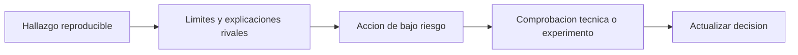

# Lección 05 - Del hallazgo a una decisión responsable

## Objetivo

Producirás un registro que permita repetir el análisis, cuestionar sus límites y decidir la siguiente acción sin exagerar la evidencia.

## El formato de un hallazgo profesional

Un análisis no termina al encontrar un número. Debe permitir que otra persona responda «¿de dónde salió?» y «¿qué hacemos mañana?». Para cada hallazgo registra:

1. Pregunta y decisión a la que aporta evidencia.
2. Fuente, versión del archivo, periodo y grano.
3. Filtros, definiciones y código o pasos reproducibles.
4. Resultado con numerador, denominador y comparación.
5. Interpretación y explicaciones alternativas.
6. Límite o riesgo de calidad.
7. Siguiente acción, responsable y señal que la confirmaría.

## Ejemplo completo de Nébula

> **Hallazgo.** Entre 05-05 y 11-05, la conversión agregada de Android es menor que en el periodo de referencia; web no muestra la misma magnitud de cambio. Se calcula como suma de `compras` dividida por suma de `visitas`, con filas agregadas por día/canal/plataforma. La coincidencia temporal con la versión 4.2 es consistente con una incidencia, pero no demuestra causalidad. Antes de pausar una campaña, ingeniería debe contrastar errores del formulario y pagos confirmados con los eventos exportados. Una fila con compras cero el 08-05 se conserva hasta verificar tracking.

Esta nota dice qué se observó y qué falta. Una mala versión sería «la versión 4.2 rompió Android»: oculta el método, borra incertidumbre y puede hacer actuar al equipo sobre una causa falsa.

El flujo no termina en una conclusión tajante. La salida del EDA es una acción proporcional a la evidencia y una forma concreta de aprender más.

## Privacidad y comunicación

Para una incidencia de checkout no necesitas exportar correos, tarjetas ni identificadores personales a un notebook. Minimiza las columnas, agrega donde sea suficiente y usa datos sintéticos para compartir ejemplos. También evita nombrar a una persona o equipo como causa sin evidencia: los registros suelen tener fallos de proceso, no culpables evidentes.

## Comprobación

1. ¿Qué tres elementos hacen reproducible un hallazgo?
2. ¿Qué acción es razonable con evidencia descriptiva y cuál exigiría evidencia causal?
3. ¿Cómo comunicarías una limitación de tracking sin bloquear la investigación?

Continúa con el [laboratorio reproducible](06-laboratorio-incidencia-checkout.md).
