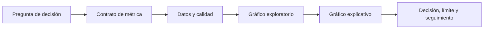

# Bloque 07 — Visualización y comunicación de datos

## Propósito

Una visualización es una afirmación hecha con datos: decide qué comparación será visible y qué quedará fuera. En este bloque Leo trabaja como analista de **Lumen**, una app de suscripción. El equipo observa que las altas se mantienen, pero los pagos terminados han caído. El objetivo no es “hacer gráficos bonitos”: es entregar evidencia que permita decidir si investigar el checkout, una campaña o el propio sistema de medición.

## Resultados observables

Al terminar podrás convertir una pregunta en un gráfico defendible; construirlo con Matplotlib y Seaborn; explicar su población, denominador, periodo y límites; y diseñar un dashboard que un responsable pueda usar sin interpretar a ciegas.

## Prerrequisitos

Se parte del bloque 05 (tablas con Pandas) y 06 (EDA). Un gráfico no sustituye revisar duplicados, valores ausentes o una definición de métrica: los hace más fáciles de detectar y comunicar.

## Caso continuo: Lumen

La tabla de ejemplo representa sesiones diarias. Cada fila agrega un día y un canal; `visitas` es el número de sesiones, `inicio_checkout` las sesiones que empezaron a pagar y `pago` las que terminaron. Por tanto, la conversión de pago es `pago / visitas`, no el número de pagos. Cambiar el denominador cambia la pregunta.

El flujo evita el error habitual de empezar por una plantilla de dashboard: primero se decide qué evidencia hace falta y después cómo verla.

## Lecciones

1. [De la pregunta al tipo de gráfico](lecciones/01-pregunta-y-tipo-de-grafico.md)
2. [Diseño honesto, accesible y reproducible](lecciones/02-diseno-honesto-y-accesible.md)
3. [Matplotlib y Seaborn: de datos a evidencia](lecciones/03-exploracion-y-narrativa.md)
4. [Dashboards y entregables profesionales](lecciones/04-dashboards-y-entregables.md)

## Práctica y laboratorio

Sigue el laboratorio reproducible [11-visualizacion-lumen.py](../../notebooks/practicas/07-visualizacion-lumen.py). Después resuelve el [caso de diagnóstico](../../ejercicios/temario-07/aplicacion/diagnostico-lumen.md) antes de consultar la [solución razonada](../../soluciones/temario-07/diagnostico-lumen.md).

## Fuentes técnicas

La interfaz `plt.subplots` y el modelo Figure/Axes se consultan en la [documentación de Matplotlib](https://matplotlib.org/stable/api/_as_gen/matplotlib.pyplot.subplots.html); Seaborn documenta sus interfaces de alto nivel en su [tutorial oficial](https://seaborn.pydata.org/tutorial.html). Para color, revisa [la guía oficial de mapas de color](https://matplotlib.org/stable/users/explain/colors/colormaps.html).
