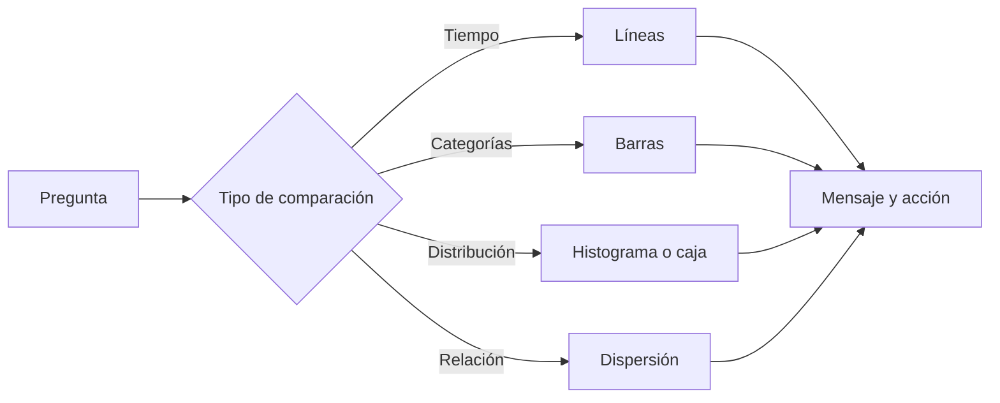

# Bloque 07 - Visualización y comunicación

## Objetivo

Elegir y construir visualizaciones que permitan comprender una decisión con rapidez, sin distorsionar los datos.

## Pregunta antes que gráfico

La elección empieza por el mensaje: compara categorías con barras, evolución temporal con líneas, distribución con histogramas o cajas, y relación entre dos variables con dispersión. No hay un gráfico universalmente mejor.

## Diseño honesto

Etiqueta ejes y unidades, usa escalas coherentes y evita cortar un eje de barras cuando convierta diferencias pequeñas en aparentes abismos. El color debe reforzar significado, no decorar. Piensa también en contraste y personas con visión reducida del color.

## De exploración a comunicación

Un gráfico exploratorio ayuda a pensar; uno explicativo ayuda a decidir. El segundo elimina elementos irrelevantes, destaca la comparación importante y añade un título que exponga el hallazgo, no solo el nombre de la métrica.

## Entregables profesionales

Un análisis suele terminar en un dashboard, una presentación, un ticket de Jira o una nota ejecutiva. Cada formato necesita contexto, definición de métricas, hallazgo, recomendación y limitaciones.

## Ejercicio

Haz el [diagnóstico de gráficos](../../ejercicios/temario-07/comprension/elegir-grafico.md) y comprueba [los criterios](../../soluciones/temario-07/elegir-grafico.md).
