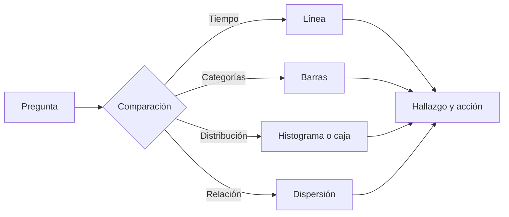

# De la pregunta al tipo de gráfico

## Objetivos y prerrequisitos

Sabrás escoger una representación según la comparación que una decisión necesita. Requiere EDA básico.

Un gráfico no es una decoración de una tabla: es una forma de hacer visible una comparación. Pregunta primero si necesitas mostrar evolución, diferencias entre categorías, distribución o relación entre dos medidas.

Una línea responde bien a “¿cómo cambió semanalmente la conversión?”. Unas barras ordenadas responden mejor a “¿qué canal tiene más pedidos?”. Un histograma muestra si un promedio es representativo. Un gráfico de dispersión ayuda a explorar asociación, no a afirmar causalidad.

## Error habitual

Elegir un gráfico porque “queda profesional”. Un gráfico circular con muchas categorías impide comparar; una línea sobre categorías sin orden temporal inventa continuidad. El gráfico correcto depende de la pregunta y del tipo de dato.

## Resumen

Declara la pregunta antes del gráfico. Continúa con [diseño honesto](02-diseno-honesto-y-accesible.md).
