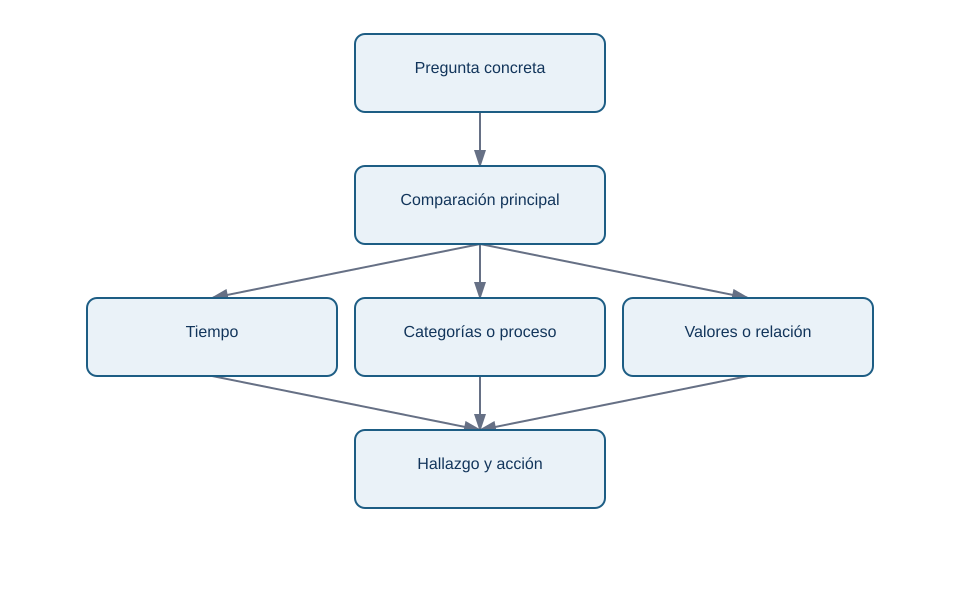
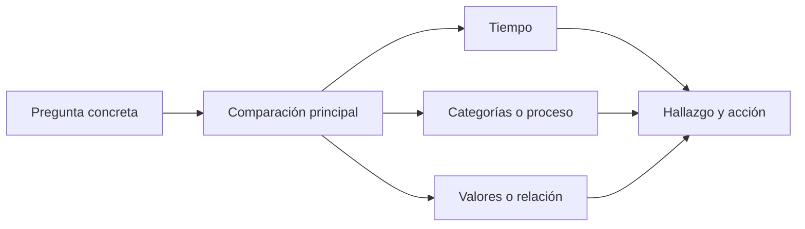

# Lección 01 — De la pregunta al tipo de gráfico

## Objetivos y prerrequisitos

Sabrás elegir una representación según la comparación necesaria y justificar por qué su forma no induce una conclusión falsa. Necesitas distinguir fila, columna, variable numérica, categoría y fecha.

## Antes del gráfico: la decisión y el contrato

Imagina que la responsable de Lumen pregunta: “¿por qué bajaron los pagos?”. Esa frase no pide todavía una gráfica. Hay que concretar: *¿bajó el número de pagos, la conversión de visitas a pago o ambos; desde cuándo; para qué usuarios; y qué decisión depende de ello?* Un **contrato de métrica** deja escrito numerador, denominador, población, periodo, fuente y responsable.

En Lumen se comprueba primero que `pago` cuenta pagos finalizados únicos y que `visitas` cuenta sesiones. La conversión diaria es `pago / visitas`. Si el tráfico se duplica pero los pagos se mantienen, los pagos no “caen”, pero la conversión sí. La misma columna puede responder preguntas distintas solo con cambiar el denominador.

## Elegir la comparación

La pregunta siguiente guía la forma. Este esquema responde: “¿qué tipo de relación necesito ver?”

<!-- mobile-diagram: rendered fallback -->

Ver código Mermaid editable

La ramificación no es una receta automática. Una línea codifica continuidad temporal: úsala para la conversión diaria de Lumen, donde el eje horizontal sí tiene orden y distancia. Barras horizontales ordenadas permiten comparar la conversión por canal sin obligar al lector a adivinar cuál es mayor. Un histograma muestra cuántas observaciones caen en intervalos; sirve para estudiar la distribución de tiempo de carga, no para contar categorías. Una caja resume mediana, cuartiles y posibles valores extremos, pero no muestra todos los picos de una distribución pequeña.

Un gráfico de dispersión coloca cada observación en dos ejes numéricos. Si cada punto es una campaña, puede explorar asociación entre gasto e ingresos. No prueba que el gasto *cause* el ingreso: una campaña de temporada o la calidad del público pueden explicar ambos.

## Funnel: no es una pirámide decorativa

En un **funnel** cada paso es una condición del proceso: visita → inicio de checkout → pago. Hay que mostrar el número de personas y el porcentaje respecto al paso anterior, y decidir si cada persona puede repetir el evento. Si `inicio_checkout` tiene más sesiones que visitas, la visualización ha descubierto un problema de grano, de instrumentación o de definición; no hay que “arreglarlo” recortando la barra.

Ejemplo: 10.000 visitas, 2.000 inicios y 1.600 pagos. Conversión de visita a pago = 16%; de inicio a pago = 80%. El primer porcentaje orienta adquisición y producto; el segundo orienta checkout. Nunca digas “la conversión es 80%” sin el paso de referencia.

## Ejemplo trabajado: caída tras una versión

Lumen despliega la versión 4.2 el 15 de mayo. Para decidir si abrir una incidencia se construye una línea de conversión diaria, se marca la fecha del despliegue y se separa móvil de escritorio. Después se contrasta el volumen de visitas: una caída de conversión con 50 visitas es mucho menos estable que con 50.000. El gráfico comunica una asociación temporal y una prioridad de investigación; no demuestra que el despliegue fuera la causa.

## Errores y límites

- Un gráfico circular con nueve canales hace difícil comparar ángulos similares; usa barras ordenadas.
- Una línea sobre “Android, iOS, web” inventa una continuidad que no existe.
- Agregar por semana puede ocultar una caída de un día; diario puede ser demasiado ruidoso. La granularidad se decide por la acción y el volumen.
- Un promedio de tiempo de carga puede esconder que un grupo pequeño tiene una experiencia muy mala. Complementa con distribución o percentiles.

## Resumen y comprobación

Primero formula decisión, población y denominador; luego elige una forma cuya codificación coincida con la comparación. ¿Qué gráfico usarías para pagos por canal? ¿Qué información adicional exigirías antes de interpretar un funnel? Continúa con [diseño honesto](02-diseno-honesto-y-accesible.md) y aplica estas decisiones en el [caso Lumen](../../../ejercicios/temario-07/aplicacion/diagnostico-lumen.md).
