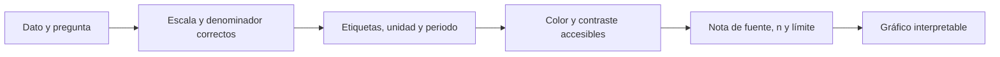

# Lección 02 — Diseño honesto, accesible y reproducible

## Objetivos y prerrequisitos

Aprenderás a hacer legible una comparación sin amplificarla, ocultar sus condiciones ni depender de que el lector distinga un color. Partimos de la elección de gráfico de la lección anterior.

## El gráfico es un argumento verificable

Una figura de Lumen debe permitir responder: qué se mide, en qué unidades, para quién, durante qué periodo y con qué fuente. Un título como “Conversión móvil cae 1,8 pp desde la versión 4.2; investigar checkout” dice la afirmación. Un subtítulo o nota dice “pagos finalizados / sesiones; usuarios autenticados; 1–31 mayo; fuente `events_v3`”. **Punto porcentual (pp)** es la diferencia entre porcentajes: pasar de 12% a 10,2% son -1,8 pp, no necesariamente -1,8% relativo.

Etiquetas, leyenda y anotaciones no son adornos. Etiqueta ejes con unidad (`Fecha`, `Conversión a pago (%)`), nombra las series directamente cuando haya pocas y anota el despliegue que se investiga. Exporta el código y la versión de datos junto a la imagen: una captura sin origen no es reproducible.

## Escalas y denominadores

En barras de magnitudes, el eje debe empezar en cero: la longitud representa cantidad. Recortar de 96% a 100% hace que una diferencia de 1 pp parezca gigantesca. En líneas de una tasa, un rango recortado puede ser legítimo para estudiar variación pequeña, pero debe verse el rango, explicarse y acompañarse de los valores. No uses eje doble para sugerir relación: dos escalas elegidas a mano pueden hacer coincidir curvas no relacionadas.

El denominador es parte del mensaje. “800 pagos” y “8% de conversión” no son intercambiables. Compara canales con tráfico distinto mediante tasa y muestra además el tamaño de muestra (`n`). Una conversión de 20% sobre 10 visitas no tiene la misma fuerza descriptiva que 18% sobre 10.000; la lección 08 formaliza intervalos, pero aquí se debe declarar la fragilidad.

## Color, forma y lectura en móvil

El color debe codificar algo consistente: por ejemplo, azul para escritorio y naranja para móvil en todas las figuras de Lumen. No codifiques éxito/fracaso solo con verde/rojo ni uses arcoíris para datos ordenados: añade etiquetas, línea continua/discontinua o marcadores. Comprueba contraste sobre fondo claro y en escala de grises. Para una audiencia móvil, reduce series, aumenta tamaño de texto, evita leyendas lejanas y prioriza un mensaje por panel.

Cada paso protege una inferencia distinta: una paleta agradable no compensa un denominador equivocado, y una cifra exacta no compensa que el lector no pueda verla.

## Incertidumbre y valores ausentes

Una banda alrededor de una estimación puede mostrar intervalo de confianza o de variabilidad; no es un adorno translúcido. Debe indicar qué representa, cómo se calculó y qué población cubre. Si hay datos ausentes, no unas con una línea como si se hubieran medido: deja hueco o marca la zona. Si el tracking de pago dejó de enviar eventos dos días, el gráfico debe decirlo; concluir “checkout roto” sería confundir un problema de medición con un problema de producto.

## Contraejemplo: la mejora que desaparece

Un informe muestra que móvil pasa de 9,8% a 10,4% y colorea la segunda barra en verde. Cuando se desglosa por canal, el tráfico de un canal de alta conversión aumentó y cada canal se mantuvo o cayó. El total cambia por mezcla, no necesariamente porque la experiencia móvil mejorase. El gráfico correcto compara el total y el desglose, declara los denominadores y evita causalidad no demostrada.

## Resumen y comprobación

Un diseño honesto hace visibles definición, escala, tamaño de muestra y límites. ¿Cuándo es admisible recortar un eje? ¿Qué más añadirías a una línea de conversión si faltan tres días de tracking? Continúa con [Matplotlib y Seaborn](03-exploracion-y-narrativa.md).
