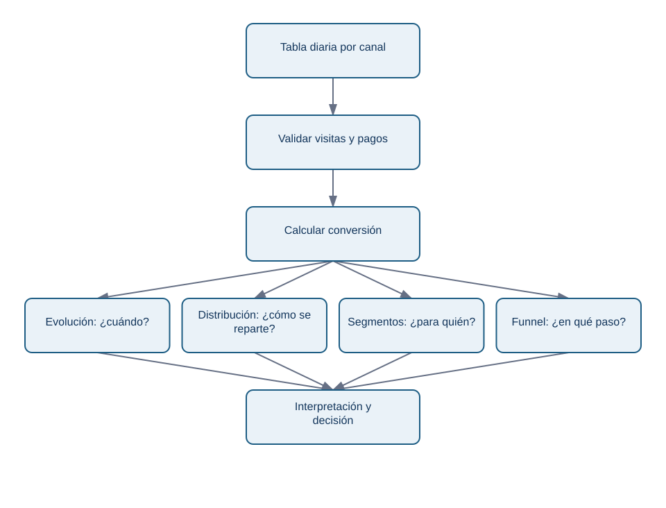
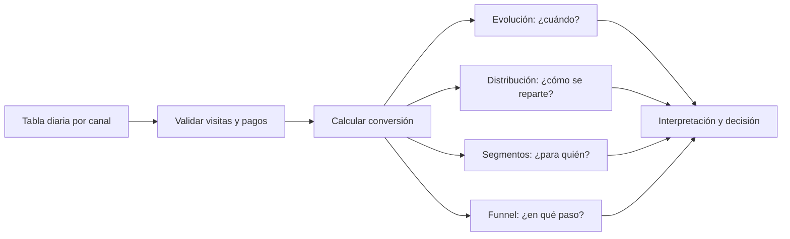

# Lección 03 — Matplotlib y Seaborn: de datos a evidencia

## Objetivos y prerrequisitos

Construirás gráficos reproducibles de evolución, distribución, segmentos y funnel, y distinguirás un gráfico para descubrir de uno para recomendar. Requiere Pandas básico: un `DataFrame` es una tabla en memoria; una columna se selecciona con `datos["columna"]`.

## Dos herramientas, un modelo mental

**Matplotlib** dibuja la figura y ofrece control fino. Una `Figure` es el lienzo completo; un `Axes` es un panel con sus ejes, título y marcas. `fig, ax = plt.subplots()` crea ambos. **Seaborn** se apoya en Matplotlib y facilita gráficos estadísticos y agrupaciones; no elimina la necesidad de conocer la métrica ni la escala.

```python
import matplotlib.pyplot as plt

fig, ax = plt.subplots(figsize=(8, 4))
ax.plot(diario["fecha"], diario["conversion_pct"], marker="o")
ax.set(title="Conversión diaria de Lumen", xlabel="Fecha", ylabel="Conversión (%)")
ax.grid(axis="y", alpha=0.25)
fig.tight_layout()
fig.savefig("salidas/conversion_diaria.png", dpi=160, bbox_inches="tight")
```

`ax` recibe las instrucciones del panel; `fig.savefig` guarda un resultado que se puede revisar en un ticket, repositorio o presentación. La fecha, el cálculo de `conversion_pct` y el código deben permanecer disponibles para reproducir la imagen.

## Caso Lumen: de tabla a cuatro preguntas

El laboratorio usa 28 días de sesiones agregadas por canal. Primero calcula `conversion_pct = 100 * pago / visitas`, comprobando que `visitas` no es cero. La evolución diaria pregunta si hay cambio y cuándo; un histograma pregunta cómo se reparte la conversión de los segmentos; barras ordenadas comparan canales; el funnel pregunta dónde se pierde el volumen.

<!-- mobile-diagram: rendered fallback -->


<details>
<summary>Ver código Mermaid editable</summary>


</details>

La misma tabla admite varias vistas, pero cada vista responde una pregunta diferente. No conviertas las cuatro en una única imagen ilegible.

## Evolución, anotación y comparación limpia

Para una línea temporal, ordena por fecha, dibuja una serie por grupo solo si hay pocas y usa `ax.axvline(fecha_despliegue)` para marcar una intervención. `ax.annotate(...)` puede explicar el contexto; no debe tapar puntos ni presentar la anotación como prueba causal. Si móvil cae tras una versión y escritorio no, es una hipótesis prioritaria: aún hay que comprobar cambios de tráfico, tracking y estacionalidad.

Para barras por canal usa `sort_values`, `ax.barh` y el valor sobre cada barra. El eje de una conversión puede comenzar cerca del rango analizado si se declara claramente; para volúmenes, empieza en cero. Evita barras apiladas cuando el lector necesite comparar una parte interna de cada barra: la base cambia y la comparación se vuelve difícil.

## Distribución y segmentación

Un histograma agrupa valores en intervalos o *bins*. Cambiar los intervalos puede cambiar la impresión: prueba una elección razonable y declara que resume. Con Seaborn, `sns.histplot(data=..., x="conversion_pct", hue="canal")` puede comparar grupos, pero demasiados colores convierten la figura en ruido. Una caja por canal ayuda a comparar mediana y dispersión; revisa observaciones antes de llamar “anómalo” a un valor.

El siguiente fragmento deja explícito que cada punto del gráfico es una fila agregada día-canal, no una persona:

```python
import seaborn as sns

sns.set_theme(style="whitegrid")
fig, ax = plt.subplots(figsize=(8, 4))
sns.boxplot(data=diario, x="canal", y="conversion_pct", ax=ax, color="#8ecae6")
ax.set(title="Distribución diaria de conversión por canal", xlabel="Canal", ylabel="Conversión (%)")
```

## Exploración frente a explicación

En exploración es sano generar gráficos provisionales, cambiar filtros y buscar errores. Conserva un registro de qué filtros y versiones usaste. El gráfico explicativo llega después y debe contestar una afirmación concreta: “La conversión móvil cae 1,8 pp desde la versión 4.2; el descenso se concentra en inicio → pago”. Incluye evidencia, recomendación y límite: “asociación temporal; validar eventos `payment_success`”.

Un gráfico con veinte series y filtros puede ser útil al analista, no a dirección. La compresión profesional consiste en retirar lo que no cambia la decisión, no en retirar el periodo, la fuente o los valores incómodos.

## Resumen y práctica

Figure contiene paneles; Axes recibe el gráfico; Seaborn acelera patrones habituales. Exporta el resultado y conserva el código. Ejecuta [el laboratorio Lumen](../../../notebooks/practicas/07-visualizacion-lumen.py) y resuelve [el caso aplicado](../../../ejercicios/temario-07/aplicacion/diagnostico-lumen.md).
