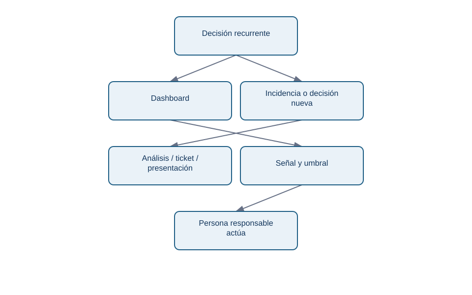
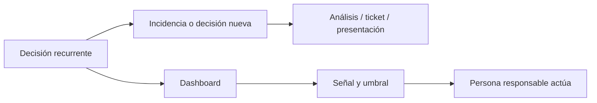
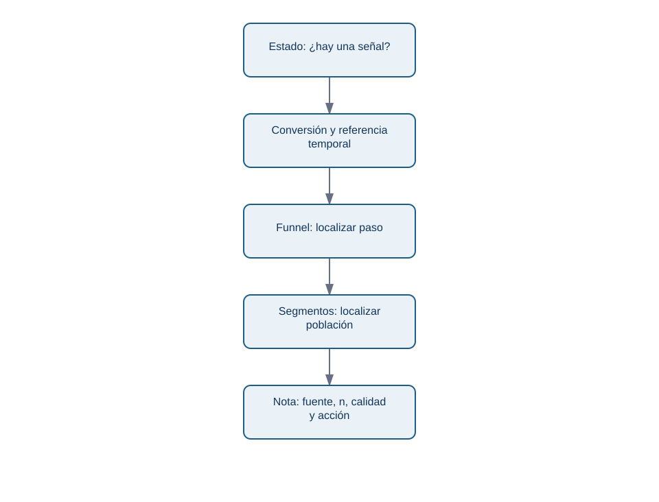
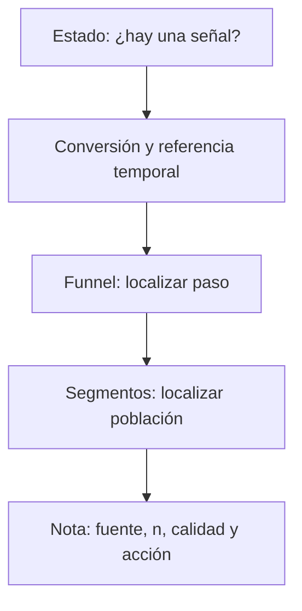

# Lección 04 — Dashboards y entregables profesionales

## Objetivos y prerrequisitos

Diseñarás un dashboard como un producto de seguimiento y elegirás cuándo una nota, un ticket o una presentación es mejor. Requiere saber definir métrica y leer gráficos temporales y por segmentos.

## Dashboard no significa “pared de KPI”

Un **dashboard** es una interfaz para seguimiento recurrente: alguien vuelve a ella para detectar si una condición merece actuar. Un análisis responde una pregunta nueva con método y conclusión. Si Lumen necesita decidir hoy si revierte la versión 4.2, un ticket con evidencia y recomendación puede ser más útil que añadir veinte gráficos permanentes.

<!-- mobile-diagram: rendered fallback -->

Ver código Mermaid editable

La diferencia es operacional: un panel sin responsable, umbral o acción es una pantalla, no un sistema de decisión.

## Contrato de un panel

Cada panel de Lumen necesita un pequeño contrato. Escribe: pregunta de decisión; métrica y fórmula; población, grano y ventana; fuente y tiempo de actualización; propietario; umbral o comparación; acción cuando la señal se rompe; y limitaciones conocidas. Por ejemplo: “Conversión visita→pago diaria, sesiones autenticadas, UTC, `events_v3`, se refresca cada mañana; propietaria: Product Analytics; investigar si móvil cae más de 1 pp frente a media de 7 días y n ≥ 5.000”.

La métrica debe tener enlace a su definición, no depender de un nombre ambiguo como “usuarios activos”. Los filtros se diseñan para decisiones reales: periodo, plataforma y país pueden ser útiles; permitir filtrar por veinte atributos sin explicar el denominador facilita *cherry-picking*.

## Arquitectura recomendada para Lumen

La primera pantalla debe poder leerse en móvil. Un titular con fecha de actualización y estado; una línea de conversión frente a referencia; un pequeño funnel con denominadores; un desglose de segmentos que explica el cambio; y una nota de calidad o incidencia. El detalle va en una segunda vista, no en miniaturas ilegibles.

<!-- mobile-diagram: rendered fallback -->

Ver código Mermaid editable

La lectura es deliberada: primero detectar, después localizar y finalmente actuar. Si el funnel indica caída solo en inicio→pago para móvil, la siguiente acción es revisar checkout y eventos, no comprar más tráfico.

## Entrega ejecutiva: afirmación, evidencia, acción

Para la incidencia de Lumen, una nota de una página puede seguir esta estructura: (1) **qué ocurre**: “la conversión móvil cae 1,8 pp desde 4.2”; (2) **evidencia**: línea diaria, n, segmento y paso de funnel; (3) **interpretación**: asociación temporal, no causalidad probada; (4) **recomendación**: validar `payment_success`, reproducir checkout y valorar reversión; (5) **riesgo y siguiente dato**: revisar mezcla de canales y usuarios afectados. Un ticket de Jira debe enlazar query, versión de datos y dueños; una presentación no debe ser la única copia de la metodología.

## Fallos habituales

- Actualización atrasada sin etiqueta: el lector toma decisiones con datos viejos.
- Total sano que oculta una caída en un segmento grande: muestra la composición o una alerta de segmento.
- Umbral fijo sin contexto: una variación normal de bajo volumen genera alarmas inútiles.
- Mezclar métricas de distintas zonas horarias o definiciones: aparenta una caída que es un cambio de contrato.
- Mostrar “verde” como éxito cuando la métrica puede ser una guardrail: más tiempo en pantalla quizá es peor.

## Resumen y comprobación

Un dashboard es un acuerdo de seguimiento, no una galería. Antes de publicar pregunta quién actuará, qué valor dispara revisión y qué limitación puede invertir la interpretación. Completa el [diagnóstico Lumen](../../../ejercicios/temario-07/aplicacion/diagnostico-lumen.md); el bloque 08 aporta herramientas formales para cuantificar incertidumbre.
