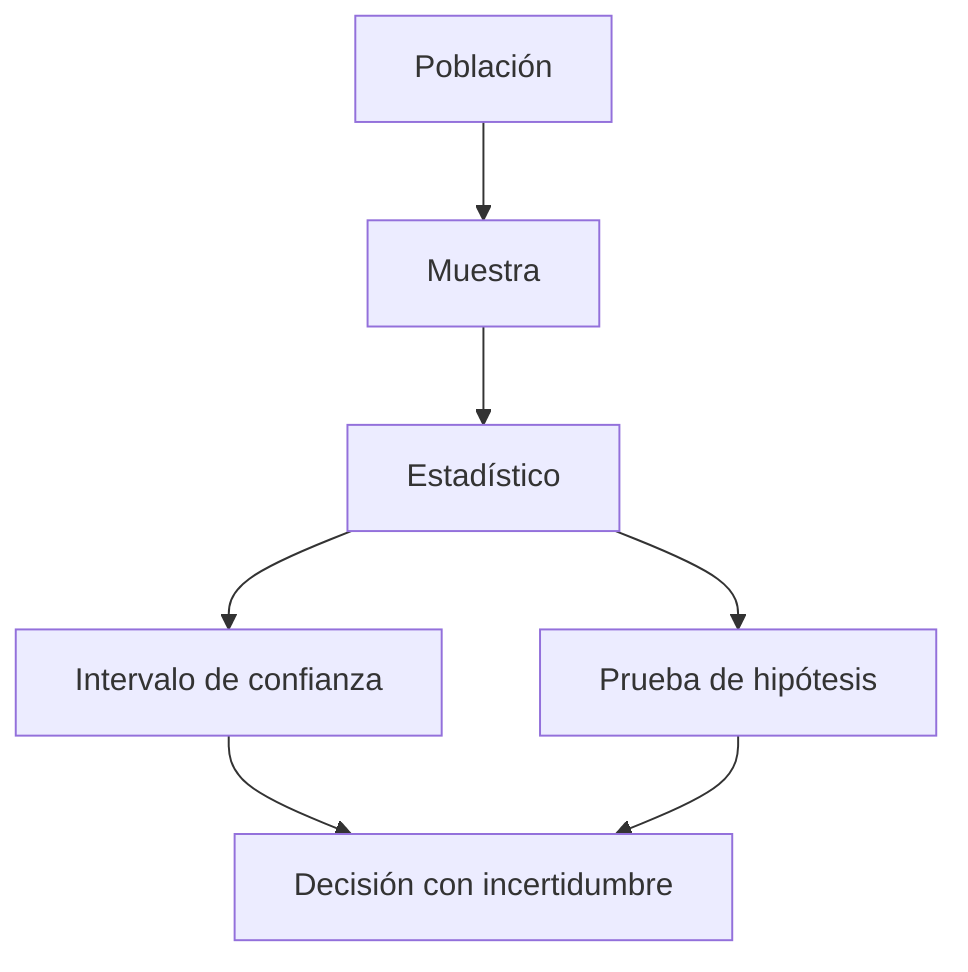

# Bloque 08 - Estadística para decisiones

## Objetivo

Medir incertidumbre, evaluar diferencias y comunicar resultados sin convertir el p-valor en una respuesta automática.

## Población, muestra y variabilidad

La población es el conjunto que te interesa; la muestra es la parte observada. Un estadístico resume una muestra y un parámetro describe la población. Muestras distintas producen resultados distintos: esa variabilidad es parte del problema, no un fallo.

## Intervalos y pruebas

Un intervalo de confianza expresa un rango compatible con el método y los datos. Una prueba de hipótesis compara los datos con una hipótesis nula. Un p-valor pequeño no mide el tamaño del efecto, la importancia de negocio ni la probabilidad de que una hipótesis sea cierta.

## Experimentos A/B

Define antes la métrica principal, métricas de guardrail, duración y criterio de decisión. Evita mirar resultados cada día y declarar ganador en el primer pico: esa práctica aumenta falsos positivos.

## Tamaño del efecto

Una diferencia minúscula puede ser estadísticamente detectable con muchos datos y aun así no justificar ninguna acción. Comunica siempre efecto absoluto, efecto relativo, incertidumbre y coste de actuar.

## Práctica

Analiza [un experimento de onboarding](../../ejercicios/temario-08/aplicacion/experimento-onboarding.md) y revisa [la interpretación](../../soluciones/temario-08/experimento-onboarding.md).
