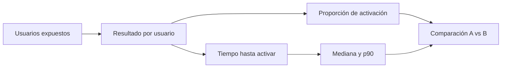

# 01 — Describir una métrica y su variabilidad

## Resultado y prerrequisitos

Al terminar podrás construir una descripción inicial de un experimento que diga **quién fue medido, qué ocurrió y cuánto varían los casos**. Requiere saber calcular porcentajes. El resultado observable es una tabla de activación de Nexo que no confunda promedio, proporción y experiencia individual.

## Antes de la jerga: ¿qué estamos resumiendo?

Imagina diez personas que abren Nexo. Ocho crean una tarea en menos de un día y dos no. Antes de hablar de «tasa de conversión», vemos diez resultados: `1, 1, 1, 0, 1, 1, 1, 1, 0, 1`. Un `1` representa activación y un `0` no activación. El resumen `8 de 10` es útil porque permite comparar grupos, pero borra la historia de cada persona.

La **proporción** o tasa de activación es `éxitos / usuarios elegibles`. Aquí es `8 / 10 = 0,80`, o 80 %. Para una variable de ceros y unos, su media numérica coincide con esa proporción. No ocurre así con cualquier variable: la media de tiempos de carga no es un porcentaje.

En el experimento de Nexo la definición completa es: «proporción de usuarios nuevos, elegibles, asignados y expuestos, que crean proyecto y tarea en las 24 horas posteriores a la exposición». Esta frase es el **contrato de métrica**. Sin ventana, población y evento, dos personas pueden calcular “activación” y obtener números incompatibles.

## Centro, dispersión y forma

Una media responde dónde está el centro; la **variabilidad** indica cuánto se alejan los casos de ese centro. Para variables numéricas continuas, como minutos hasta completar onboarding, se combinan varias lentes:

- **Mediana:** valor del usuario central tras ordenar los tiempos. Resiste mejor una cola de usuarios bloqueados.
- **Percentil 90 (p90):** el 90 % tarda ese valor o menos; deja visible la experiencia lenta.
- **Rango intercuartílico (IQR):** distancia entre p75 y p25; describe la parte central sin depender tanto de extremos.
- **Desviación estándar:** distancia típica respecto de la media; es útil, pero puede ocultar asimetría y valores extremos.

Supón que A y B tienen media de 4 minutos. En A casi todos tardan entre 3 y 5; en B unos tardan 1 y otros 12. La media no permite concluir que la experiencia sea igual. Para un flujo de producto conviene mirar una distribución o percentiles antes de celebrar una media.

Este esquema separa dos preguntas: si B cambia la probabilidad de activar y si cambia el esfuerzo o demora de quien activa. Una variante puede elevar conversiones y empeorar mucho el tiempo de algunos usuarios; ambas cosas importan.

## Ejemplo trabajado: primera lectura de Nexo

| Variante | Elegibles | Activados | Activación | Mediana de minutos | p90 de minutos |
| --- | ---: | ---: | ---: | ---: | ---: |
| A | 2.000 | 400 | 20,0 % | 6 | 19 |
| B | 2.000 | 430 | 21,5 % | 5 | 27 |

B supera a A en 1,5 **puntos porcentuales** (pp): 21,5 % − 20,0 %. Su cambio **relativo** es `1,5 / 20,0 = 7,5 %`. No son lo mismo: «7,5 %» sin base puede sonar mucho; «1,5 pp» hace visible el tamaño sobre cada 100 usuarios. El p90 de B merece investigación: el tutorial ayuda a muchos, pero puede atascar a una minoría.

## Error frecuente y límite

No elimines automáticamente a quien no activó porque “ensucia” la media de minutos. Ese usuario forma parte del resultado del producto; convertirlo en dato ausente sesga la descripción. En cambio, hay que distinguir un cero real (no activó) de una ausencia de registro por fallo de tracking. El bloque 05 enseña cómo auditar y limpiar esa diferencia.

Describir no demuestra que B causó el cambio. Todavía puede haber azar, segmentos distintos o fallos de asignación. En la siguiente lección definimos qué conjunto queremos conocer y por qué una muestra puede engañar.

## Resumen y comprobación

Una buena descriptiva conserva denominadores, unidad y variabilidad. La media no sustituye a percentiles ni a una definición de evento.

1. ¿Por qué una tasa de 21 % necesita un denominador y una ventana temporal?
2. Si el p90 empeora pero la mediana mejora, ¿qué usuarios merece revisar el equipo?
3. ¿Cuántos puntos porcentuales separan 20 % y 21,5 %?

Práctica: registra la tabla inicial en el [ejercicio de onboarding](../../../ejercicios/temario-08/aplicacion/experimento-onboarding.md).
