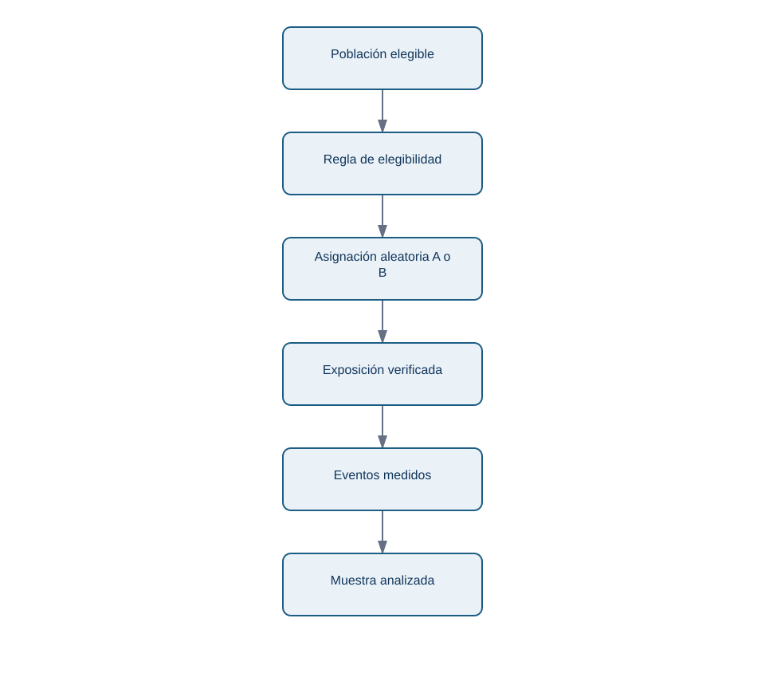
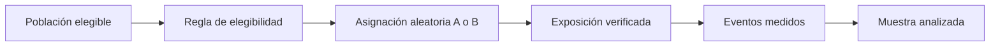

# 02 — Población, muestra, aleatorización y sesgo

## Resultado y prerrequisitos

Sabrás dibujar el recorrido desde los usuarios a los que se quiere afectar hasta los datos que se analizan, identificando exclusiones y sesgos. Necesitas la definición de métrica de la lección anterior.

## El conjunto deseado no siempre es el observado

Nexo quiere decidir sobre los nuevos usuarios de web en España que pueden ver onboarding. Ese conjunto completo se llama **población objetivo**. Durante dos semanas solo vemos a 4.000 de ellos: una **muestra**. El número calculado con la muestra —por ejemplo 21,5 %— es un **estadístico**. El valor real, desconocido, para toda la población se llama **parámetro**.

Una muestra grande reduce fluctuación aleatoria, pero no cura que esté mal escogida. Si B se muestra únicamente a personas que llegan desde una campaña de pago y A a tráfico orgánico, la diferencia mezcla variante y canal. Eso es **sesgo de selección**: el mecanismo de entrar en cada grupo está relacionado con características que afectan al resultado.

<!-- mobile-diagram: rendered fallback -->

Ver código Mermaid editable

El flujo responde «¿dónde puede cambiar quién llega al análisis?». Cada flecha es auditable: una exclusión tras conocer el resultado, una asignación rota o un evento perdido cambian lo que el número representa.

## Aleatorizar no es repartir “más o menos igual”

La **asignación aleatoria** usa una regla impredecible para que, en promedio y con suficiente muestra, las características conocidas y desconocidas se repartan entre A y B. Por ejemplo, un identificador de usuario y una función de asignación estable deciden una sola vez la variante. La **unidad de asignación** es ese usuario; se debe analizar al mismo nivel para no dar más peso a quien abre veinte sesiones.

No basta con alternar por día: si A se enseña lunes y B viernes, día de la semana queda confundido con variante. Tampoco se debe cambiar de variante a una misma persona. Ambas prácticas rompen la comparación causal.

### Comprobación previa, no búsqueda de excusas

Antes de mirar activación, revisa una tabla de calidad: número asignado, porcentaje expuesto, duplicados, país, dispositivo y fecha. Las pequeñas diferencias por azar pueden ocurrir; una diferencia grande y sistemática revela posible problema de implementación. No “ajustes” datos hasta equilibrarlos: documenta la exclusión y decide antes si la regla era válida.

| Revisión | Señal sana | Señal de alarma |
| --- | --- | --- |
| Asignación | cerca de 50/50, según diseño | 80/20 sin explicación |
| Exposición | evento de vista en ambas variantes | B asignada pero no renderizada |
| Unidad | un usuario por fila | sesiones repetidas como usuarios |
| Periodo | variantes concurrentes | A antes de una campaña, B después |

## Sesgo, confusión y generalización

**Confusión** significa que una tercera variable cambia junto con la variante. Si B coincide con una actualización de la app, no sabemos qué originó el efecto. La aleatorización concurrente combate confusores promedio; la calidad de medición y ejecución sigue siendo necesaria.

Incluso un experimento bien aleatorizado no prueba todo. Si solo participaron usuarios de web española, la conclusión se aplica directamente a esa población y periodo. Llevar B a móvil, otro país o una temporada de alta demanda es una extrapolación que debe etiquetarse y, si importa, probarse.

## Resumen y comprobación

Población es la decisión que importa; muestra es lo observado. El azar protege la comparación frente a muchas diferencias, no frente a tracking defectuoso o una población mal definida.

1. ¿Por qué 100.000 encuestas voluntarias pueden estar sesgadas?
2. ¿Cuál es la unidad adecuada si la variante se conserva por usuario?
3. ¿Qué diferencia hay entre falta de exposición y falta de activación?

En la siguiente lección simularemos cómo cambian muestras honestas aun cuando el producto no cambie.
