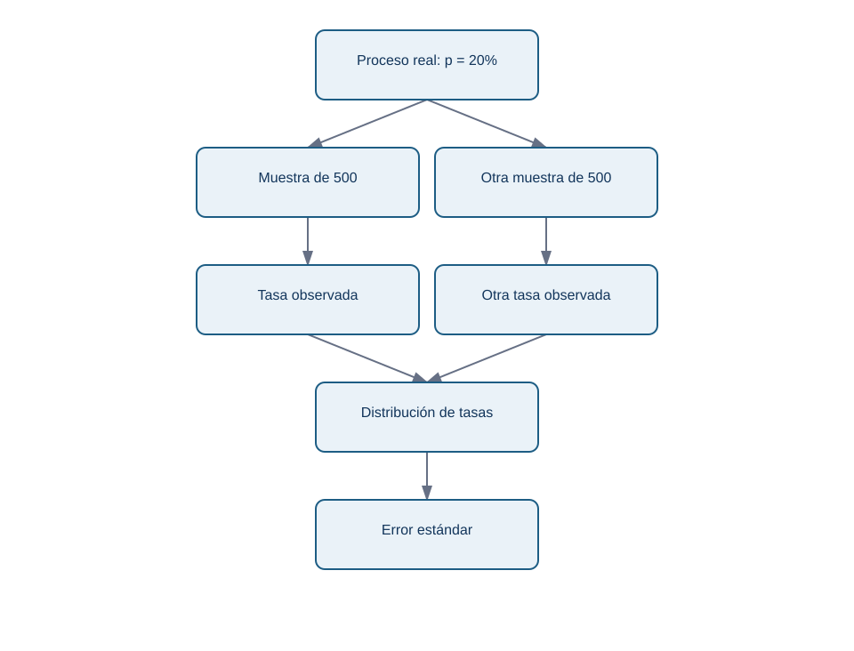
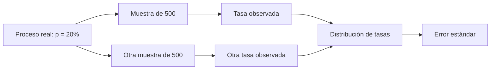

# 03 — Probabilidad, simulación y distribución muestral

## Resultado y prerrequisitos

Podrás explicar por qué dos muestras honestas dan tasas distintas y usar una simulación para hacer visible la incertidumbre. Requiere conocer población, muestra y proporción.

## Probabilidad como modelo, no como promesa

Decir que la activación de A es 20 % significa: bajo una población, periodo y medición definidos, esperamos aproximadamente 20 activaciones por cada 100 usuarios en repetidos conjuntos comparables. No significa que el siguiente usuario tenga garantizado ese resultado ni que siempre aparecerán exactamente 20 éxitos.

Para una métrica de `0/1`, un modelo simple es una **variable Bernoulli**: cada usuario tiene éxito con probabilidad `p` y fracaso con `1 − p`. Al sumar `n` usuarios obtenemos un conteo binomial. Es un modelo útil para entender el azar; sus supuestos —usuarios independientes y una probabilidad estable— pueden fallar por campañas, contagio entre usuarios o cambios de producto.

## Simular antes de memorizar una fórmula

Imagina que A y B son idénticas y ambas activan al 20 %. Extraemos 500 usuarios para cada una muchas veces. Algunas repeticiones darán 18,4 % frente a 21,0 % solo por azar. La colección de resultados de esas repeticiones se llama **distribución muestral** de la estimación.

<!-- mobile-diagram: rendered fallback -->

Ver código Mermaid editable

El diagrama muestra que el error estándar no es el error de un usuario ni un fallo del analista: resume cuánto suele variar el estimador si repitiéramos el muestreo bajo los supuestos del modelo.

## Error estándar e intuición de tamaño

Para una proporción, una aproximación del **error estándar** es:

`SE(p_estimado) = sqrt(p_estimado * (1 - p_estimado) / n)`.

Con `p_estimado = 0,20` y `n = 500`, el SE es aproximadamente 1,8 puntos porcentuales. Con 2.000 usuarios baja a aproximadamente 0,9 pp. Cuadruplicar `n` divide el error aproximadamente entre dos: por eso “el doble de datos” no duplica precisión.

Para la diferencia `p_estimado_B - p_estimado_A`, bajo grupos independientes, se combinan las incertidumbres de ambos grupos. La simulación del laboratorio evita aceptar esta fórmula a ciegas y permite comprobar que variación esperada no equivale a sesgo.

## Probabilidad condicional y segmentos

`P(activar | B)` es la tasa entre quienes recibieron B. No es igual que `P(B | activar)`, la fracción de activados que vio B. Invertir la condición es un error frecuente al leer dashboards.

Segmentar puede ser útil: quizá B ayuda a móvil y no a escritorio. Pero probar veinte segmentos aumenta oportunidades de encontrar un resultado extremo por azar. Un segmento debe ser preespecificado, tener tamaño suficiente y comunicarse como exploratorio si se descubrió después de mirar.

## Límite y resumen

La probabilidad modela incertidumbre condicionada a supuestos; no arregla datos mal instrumentados. Simular es una buena comprobación pedagógica y operativa, pero una simulación hereda el modelo que se le da.

1. Si A y B son idénticas, ¿puede B observar 1 pp más en una muestra? ¿Por qué?
2. ¿Qué cambia más el error estándar: pasar de 500 a 2.000 usuarios o de 500 a 600?
3. ¿Por qué `P(activar | B)` no responde a `P(B | activar)`?

Sigue con [intervalos y pruebas](04-intervalos-y-pruebas.md), que convierten esa variación en una regla de comunicación y decisión.
