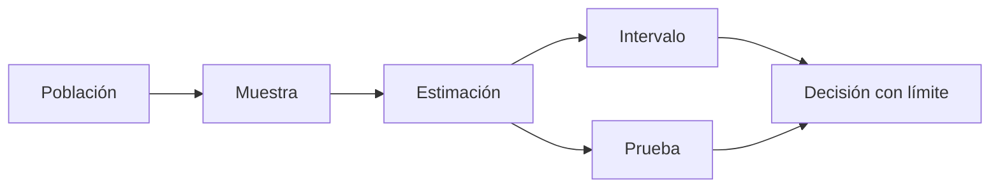

# Intervalos y pruebas de hipótesis

## Objetivos y prerrequisitos

Interpretarás un intervalo y un p-valor sin atribuirles un significado que no tienen.

Un intervalo de confianza ofrece un rango de valores compatibles con un método, datos y nivel de confianza bajo sus supuestos. Una prueba compara datos con una **hipótesis nula**, por ejemplo “no hay diferencia de conversión”. Un p-valor pequeño indica que los datos serían poco compatibles con esa hipótesis si el modelo fuera correcto.

No dice la probabilidad de que la hipótesis nula sea cierta, no mide importancia de negocio y no corrige sesgo, medición mala ni pruebas repetidas. Comunica efecto absoluto, relativo, intervalo y decisión propuesta.

## Resumen

La inferencia cuantifica incertidumbre; no sustituye juicio ni diseño. Continúa con [experimentos A/B](05-experimentos-ab.md).
