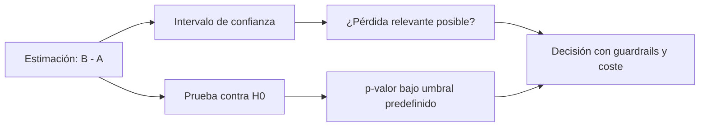

# 04 — Intervalos, hipótesis y errores de decisión

## Resultado y prerrequisitos

Podrás comunicar una diferencia A/B con intervalo, p-valor y sus límites sin convertir ninguno en una sentencia automática. Requiere entender error estándar y asignación aleatoria.

## Primero una estimación, después una etiqueta

Nexo observa A = 400/2.000 (20,0 %) y B = 430/2.000 (21,5 %). La estimación de efecto es **+1,5 pp**. Esa cifra no es el efecto verdadero conocido: otra muestra plausible habría dado otro valor.

Un **intervalo de confianza** al 95 % ofrece un conjunto de valores de diferencia que son compatibles con los datos y el procedimiento de muestreo repetido. Usando una aproximación normal, B − A podría estar, por ejemplo, entre −1,0 y +4,0 pp. La frase honesta es: “el intervalo incluye mejora y también un pequeño perjuicio; los datos no separan con precisión ambas posibilidades”. No es correcto decir “hay 95 % de probabilidad de que el parámetro esté dentro” bajo la interpretación frecuentista del intervalo.

La aproximación normal requiere tamaños y proporciones adecuados. Con tasas muy bajas, muestras pequeñas o decisiones de alto riesgo, usa intervalos de proporciones más robustos (por ejemplo Wilson), métodos exactos o consulta apoyo estadístico. El concepto sigue igual: mostrar rango y supuestos, no una falsa certeza.

## Hipótesis nula y p-valor

Una **hipótesis nula** es un punto de referencia, normalmente `H0: pB − pA = 0`. El **p-valor** responde una pregunta condicional: si H0 y el modelo fueran ciertos, ¿qué tan inusuales serían estos datos o unos más extremos? Un p-valor de 0,03 no significa “3 % de probabilidad de que no haya efecto”, ni mide valor económico.

Elegir `α = 0,05` antes de mirar datos fija una tasa de falsos positivos a largo plazo para una familia de decisiones bien especificada. Rechazar H0 con `p < α` es una regla operativa, no una prueba de certeza.

El diagrama responde por qué intervalo y prueba no compiten: la prueba compara una referencia; el intervalo muestra magnitudes plausibles. La decisión necesita ambas y el contexto de negocio.

## Errores I, II y potencia

- **Error de tipo I:** declarar un efecto cuando en realidad no existe. Su tasa se controla aproximadamente con α si se respeta el plan.
- **Error de tipo II:** no detectar un efecto real de interés. Su probabilidad es β.
- **Potencia (`1 − β`):** probabilidad de detectar un efecto de tamaño especificado si realmente existe, normalmente se planifica en 80–90 %.

Un resultado “no significativo” no demuestra equivalencia. Puede indicar poco tráfico, métrica ruidosa o efecto menor que la precisión alcanzada. Si el intervalo aún contiene un perjuicio importante y una mejora importante, la conclusión correcta es incertidumbre, no “B no hace nada”.

## Multiplicidad y parada anticipada

Si el equipo prueba cinco métricas, diez segmentos y mira el resultado cada día, aumenta la posibilidad de descubrir una coincidencia llamativa. Predefine una métrica primaria, un número de comparaciones y una regla de parada. Para múltiples pruebas confirmatorias puede usarse corrección (Bonferroni, Holm) o control de FDR según el objetivo; no apliques una receta sin documentar la familia de hipótesis.

Mirar repetidamente y detenerse en el primer `p < 0,05` invalida la interpretación convencional. Hay diseños secuenciales válidos, pero sus umbrales y análisis se planifican antes. Siempre se pueden detener experimentos por seguridad: los guardrails no esperan a la “significación”.

## Resumen y comprobación

1. ¿Qué afirmación incorrecta suele hacerse sobre un p-valor de 0,03?
2. ¿Por qué un intervalo ancho cambia una recomendación aunque el punto estimado sea positivo?
3. ¿Qué dos decisiones deben estar escritas antes de mirar resultados?

La siguiente lección convierte estos principios en un contrato A/B operativo.
