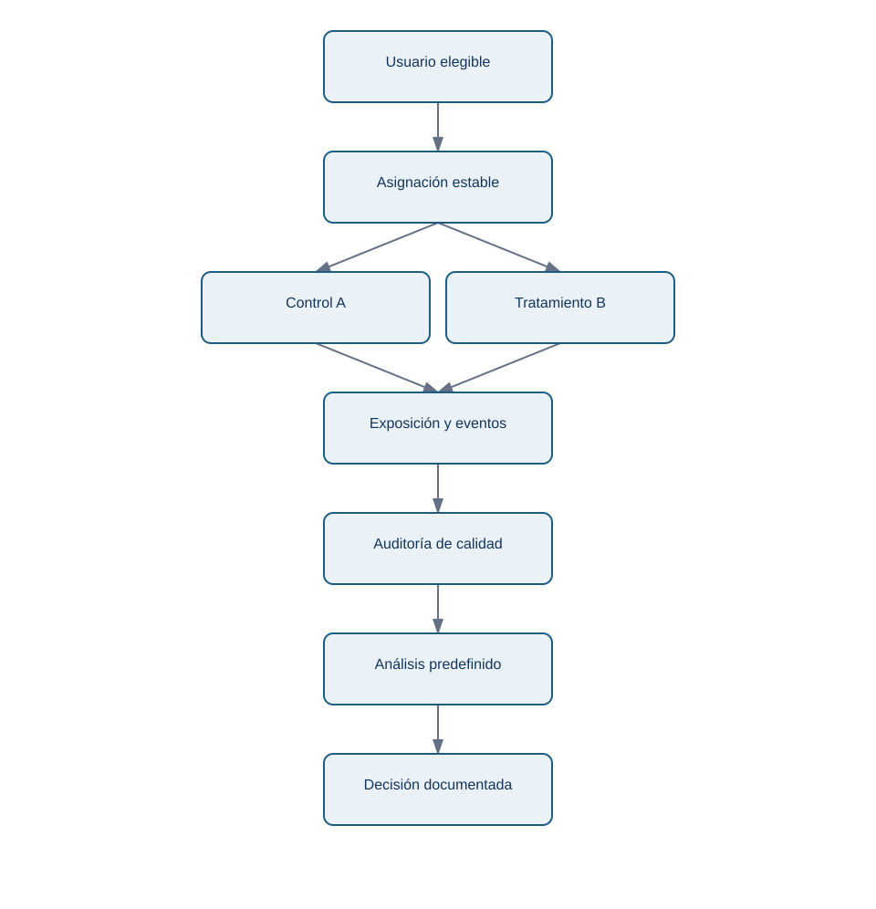
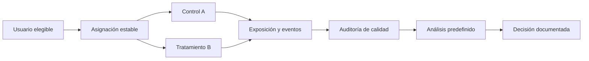

# 05 — Diseñar y operar un experimento A/B

## Resultado y prerrequisitos

Sabrás escribir un contrato mínimo de experimento antes de lanzar código y auditarlo antes de interpretar resultados. Requiere población, intervalos y errores de decisión.

## El contrato de Nexo

Un experimento empieza por la decisión, no por un gráfico. Nexo quiere saber si desplegar un onboarding guiado. Su contrato puede resumirse así:

| Elemento | Decisión predefinida |
| --- | --- |
| Hipótesis de producto | La guía reduce fricción inicial y eleva activación. |
| Población | usuarios nuevos web ES, no empleados ni cuentas de prueba. |
| Unidad | usuario; variante persistente durante 24 horas. |
| Primaria | activación en 24 h, definida como proyecto + tarea. |
| Duración | hasta tamaño calculado y al menos un ciclo semanal completo. |
| Guardrails | error técnico, tiempo p90, cancelación en 7 días. |
| Regla | lanzar solo si efecto/intervalo superan umbral y guardrails son seguros. |

La variante es un tratamiento; la activación es el resultado. Para estimar un efecto causal, B debe llegar por asignación aleatoria y la medición ha de ser igual para ambos grupos. “Tener B en el código” no demuestra que el usuario la haya visto: registra una **exposición** cuando la pantalla se renderiza correctamente.

<!-- mobile-diagram: rendered fallback -->

Ver código Mermaid editable

El flujo responde “¿qué datos hacen falta para confiar en la comparación?”. La auditoría va antes del análisis: no se usa la estadística para maquillar una experiencia que no se mostró o se midió de forma desigual.

## Intention-to-treat, exposición y exclusiones

El análisis principal suele seguir **intention-to-treat (ITT)**: comparar según variante asignada, incluso si una persona no completó la pantalla, siempre que sea elegible y esté correctamente asignada. ITT preserva la aleatorización y responde al efecto de ofrecer B.

Un análisis por exposición puede ser diagnóstico, pero excluir a quien no vio B después de asignarlo puede introducir sesgo: quizá precisamente los usuarios con conexión lenta no cargaron la guía. Declara siempre el denominador, la regla de exclusión y cuántos registros se eliminaron por variante.

## Guardrails y criterios de parada

La métrica primaria puede mejorar a costa de daño. Nexo fija como guardrails: tasa de errores de pantalla menor que +0,2 pp, p90 de tiempo no peor en más de 2 minutos y cancelación a 7 días sin deterioro relevante. Los umbrales no los decide el analista en solitario: producto, ingeniería y soporte aportan coste y tolerancia al riesgo.

Si una guardrail muestra daño grave, se pausa aunque falte muestra. Para concluir eficacia se respeta la duración/regla predefinida. Diferencia entre **parar por seguridad** y **parar para perseguir significación**.

## Heterogeneidad, privacidad y despliegue

Los segmentos previstos —por ejemplo móvil/escritorio— ayudan a detectar que un promedio oculta daño relevante. No uses segmentos exploratorios como confirmación sin replicación. Minimiza datos personales: no hace falta guardar nombre o correo para medir activación; usa identificadores pseudonimizados y controla acceso.

Un resultado positivo no obliga a un lanzamiento global instantáneo. Puede justificarse un ramp-up al 10 %, monitorización de guardrails y rollback claro. La inferencia del experimento se combina con operación segura.

## Resumen y comprobación

1. ¿Por qué conviene medir exposición además de asignación?
2. ¿Cuándo puede detenerse un experimento antes de alcanzar su muestra?
3. ¿Qué riesgo introduce excluir después de asignar a los usuarios que no completaron B?

Usa este contrato para resolver el [ejercicio](../../../ejercicios/temario-08/aplicacion/experimento-onboarding.md). La última lección traduce resultado a tamaño de muestra y decisión económica.
