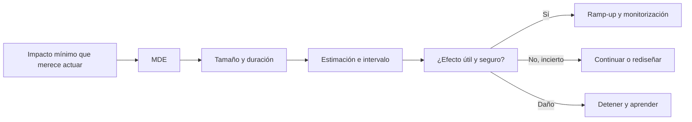

# 06 — Efecto, tamaño de muestra y recomendación

## Resultado y prerrequisitos

Al terminar podrás convertir un resultado estadístico en una recomendación con tamaño, precisión, valor económico, guardrails y plan de seguimiento. Requiere la lección de experimentos A/B.

## Tres tamaños que nunca conviene mezclar

Para Nexo, si A convierte 20,0 % y B 21,5 %:

- **Efecto absoluto:** `+1,5 puntos porcentuales`; por cada 100 usuarios elegibles hay, en promedio, 1,5 activaciones adicionales.
- **Efecto relativo:** `1,5 / 20,0 = +7,5 %`; compara con la línea base, pero necesita mostrar también la base.
- **Tamaño económico:** con 100.000 usuarios/mes, +1,5 pp equivale aproximadamente a 1.500 activaciones extra/mes. Si una activación adicional genera 4 € de margen esperado, el valor bruto orientativo es 6.000 €/mes antes de coste, retención y riesgo.

El valor económico no sale del p-valor. Exige un modelo explícito y revisable: tasa de activación, volumen afectado, valor posterior, coste de implementación y posibles daños. No conviertas una activación en ingreso seguro sin justificar la cadena.

## MDE y tamaño de muestra: diseñar para una decisión

El **efecto mínimo detectable (MDE)** es la menor diferencia que el equipo quiere poder detectar con una potencia y nivel de error elegidos. No debe elegirse porque “queda bonito”: sale de un umbral de producto. Si menos de +1 pp no paga el mantenimiento del onboarding, un experimento que solo detecta +3 pp no sirve para la decisión fina.

Para dos tasas similares, una aproximación de planificación por grupo es:

`n ≈ 2 × (z(1−α/2) + z(potencia))² × p × (1−p) / MDE²`.

Con línea base 20 %, MDE 1 pp, α=0,05 y potencia 80 %, el orden de magnitud es decenas de miles de usuarios por variante. Es una estimación: usa una calculadora o biblioteca validada para el cálculo final, documenta la fórmula y añade margen por pérdidas, exposición incompleta y exclusiones predefinidas.

El diagrama responde “¿cómo conecta el tamaño de muestra con una decisión?”. Se empieza por el impacto que justifica coste, no por ejecutar hasta que aparezca una etiqueta verde.

## Recomendación con incertidumbre

Una recomendación profesional incluye siempre:

1. **Estimación y precisión:** “B: +1,5 pp; IC 95 % [−0,3, +3,3 pp]” (ejemplo ilustrativo).
2. **Importancia:** volumen, valor esperado y MDE acordado.
3. **Daños y datos:** guardrails, exposición, duplicados, pérdidas y segmentos previstos.
4. **Acción reversible:** lanzar, mantener, continuar, replicar o detener; con responsable y fecha de revisión.

Ejemplo: “No recomiendo lanzamiento global aún. La mejora puntual es +1,5 pp, pero el intervalo permite una pérdida de 0,3 pp y el p90 empeora 3 minutos. Continuaría hasta la muestra predefinida si la guardrail de tiempo no excede el límite; si se confirma una mejora ≥1 pp sin daño, propondría ramp-up al 10 %.” Esta frase no finge que el resultado es definitivo y deja una acción verificable.

## Contraejemplos importantes

Un p-valor diminuto con millones de usuarios puede corresponder a +0,05 pp: quizá no compensa meses de ingeniería. Al revés, +3 pp con intervalo ancho puede ser económicamente prometedor pero aún no justificar un lanzamiento global. “No significativo” tampoco significa “equivalente”: para afirmar que un perjuicio no supera un límite se necesita un diseño de equivalencia/no inferioridad, umbral predefinido y asesoramiento adecuado.

## Cierre y comprobación

Estadística ayuda a cuantificar evidencia, no sustituye la decisión. La calidad del experimento, el tamaño que importa, las guardrails y la reversibilidad se razonan juntos.

1. ¿Por qué +7,5 % relativo necesita acompañarse de +1,5 pp y de la base?
2. ¿Qué decisión de negocio debe preceder al cálculo de tamaño muestral?
3. ¿Qué afirmación no permite hacer por sí solo `p > 0,05`?

Completa el [ejercicio de onboarding](../../../ejercicios/temario-08/aplicacion/experimento-onboarding.md) y ejecuta el [laboratorio](../../../notebooks/practicas/08-experimento-onboarding.py).
