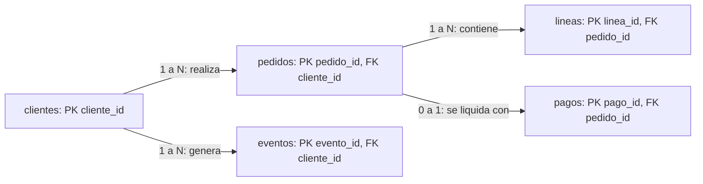

# 01. Modelo relacional, grano y ERD

## Resultado y prerrequisitos

Al acabar podrás mirar una pregunta de negocio, decir qué representa una fila y dibujar las relaciones que una consulta debe respetar. No necesitas haber usado una base de datos; conviene haber leído el bloque 01 sobre filas, columnas y claves.

## Del recibo a las tablas

Imagina que Lumen Market recibe este pedido: Ana compra dos cafés y un té. El programa debe saber quién compró, cuándo, qué artículos había y cuánto se pagó. Podría guardar todo como texto, pero después sería muy difícil responder «¿cuántos clientes distintos compraron?». Una **base de datos** es un sistema que guarda información estructurada y permite buscarla con reglas.

Una **tabla** organiza hechos del mismo tipo: columnas para atributos y filas para casos. En un modelo **relacional**, tablas distintas se conectan por identificadores. Una **clave primaria (PK)** es el valor que identifica de forma única una fila dentro de su tabla; una **clave foránea (FK)** guarda el identificador de otra tabla para expresar una relación.

La pregunta que evita la mayor parte de los errores es el **grano**: «¿qué representa exactamente una fila?». En `pedidos`, una fila es un pedido; en `lineas_pedido`, una fila es un artículo dentro de un pedido. No son intercambiables.

## El modelo de Lumen Market

La pregunta «¿qué conecta clientes, pedidos, líneas, pagos y eventos?» se responde con este diagrama entidad-relación simplificado:



Interpretación: un cliente puede no tener pedidos o tener muchos; un pedido tiene varias líneas; el ejercicio impone como simplificación un único pago por pedido. `UNIQUE(pedido_id)` en `pagos` expresa esa última regla. En un sistema real podría existir reintento, reembolso o pago dividido; entonces el grano de pagos y la relación cambiarían.

| Tabla | Grano (una fila equivale a...) | PK | FK principal | Ejemplo |
| --- | --- | --- | --- | --- |
| `clientes` | un cliente registrado | `cliente_id` | - | `C001`, Ana |
| `pedidos` | un pedido confirmado | `pedido_id` | `cliente_id` | `P100`, 2026-07-01 |
| `lineas_pedido` | un producto y cantidad de un pedido | `linea_id` | `pedido_id` | café, 2 |
| `pagos` | un intento liquidado en este ejercicio | `pago_id` | `pedido_id` | 12,40 EUR |
| `eventos` | una acción de producto con instante | `evento_id` | `cliente_id` opcional | `checkout_started` |

## Por qué el grano cambia una métrica

Supón que `P100` tiene dos líneas de 8 y 4 EUR. Esta consulta calcula ingresos por pedido correctamente:

```sql
SELECT pedido_id, SUM(cantidad * precio_unitario) AS importe
FROM lineas_pedido
GROUP BY pedido_id;
```

Pero si unes ese resultado con una tabla que contiene dos filas por pedido y vuelves a sumar, podrías obtener 24,80 en vez de 12,40. SQL no sabe cuál era tu definición de ingreso: ejecutará una combinación legal aunque la métrica sea falsa. Por ello se comprueban PK, FK, unicidad y recuentos antes y después de cada unión.

## DDL: convertir el contrato en reglas

**DDL** (Data Definition Language) es SQL para declarar la estructura. El laboratorio contiene el DDL completo; este fragmento muestra las reglas importantes:

```sql
CREATE TABLE pedidos (
  pedido_id TEXT PRIMARY KEY,
  cliente_id TEXT NOT NULL REFERENCES clientes(cliente_id),
  creado_en TEXT NOT NULL,
  estado TEXT NOT NULL CHECK (estado IN ('pagado', 'cancelado'))
);

CREATE TABLE lineas_pedido (
  linea_id INTEGER PRIMARY KEY,
  pedido_id TEXT NOT NULL REFERENCES pedidos(pedido_id),
  producto TEXT NOT NULL,
  cantidad INTEGER NOT NULL CHECK (cantidad > 0),
  precio_unitario REAL NOT NULL CHECK (precio_unitario >= 0)
);
```

`NOT NULL` no permite ausencia, `CHECK` impone una regla y `REFERENCES` exige que el pedido referido exista cuando la base activa integridad referencial. Estas protecciones reducen errores, pero no sustituyen una definición de negocio: que un pedido esté `pagado` no demuestra por sí solo que el ingreso deba reconocerse ese día.

## Error frecuente y comprobación

**Error:** llamar «clientes activos» a `COUNT(*)` de `eventos`. Ese conteo mide acciones, no personas; una misma persona puede hacer diez acciones. Decide primero la unidad: cliente, sesión, pedido o línea.

Preguntas de comprobación:

1. ¿Cuál es el grano de `lineas_pedido` y por qué no es el mismo que `pedidos`?
2. ¿Qué regla protege `UNIQUE(pedido_id)` en `pagos`?
3. Si quieres contar compradores únicos, ¿qué identificador necesitas deduplicar?

## Resumen y siguiente paso

Antes de consultar, formula el grano y las cardinalidades. En la siguiente lección convertirás una pregunta concreta en `SELECT`, filtros y agregaciones, sin perder esa disciplina.
