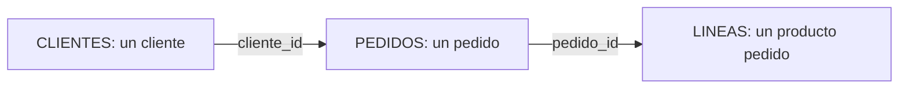

# Modelo relacional, tablas y grano

## Objetivos y prerrequisitos

Comprenderás una base de datos relacional como un conjunto de tablas conectadas, antes de escribir una consulta.

Una base de datos guarda información para que programas y personas puedan consultarla de forma consistente. En el modelo **relacional**, una tabla representa una entidad o hecho: `clientes`, `pedidos` o `eventos`. Una fila es una observación y una clave identifica o conecta filas.

La pregunta principal antes de SQL es el **grano**: ¿una fila de `pedidos` representa un pedido completo o una línea de producto? Sumar importes después de unir tablas sin responderla puede duplicar ingresos.

El diagrama muestra relaciones uno a muchos: un cliente puede tener pedidos y un pedido varias líneas. La clave no es una decoración: define qué combinaciones son válidas.

## Resumen

SQL opera sobre tablas, pero el análisis depende de grano y claves. Sigue con [selección, filtro y agregación](02-sql-seleccion-filtro-y-agregacion.md).
