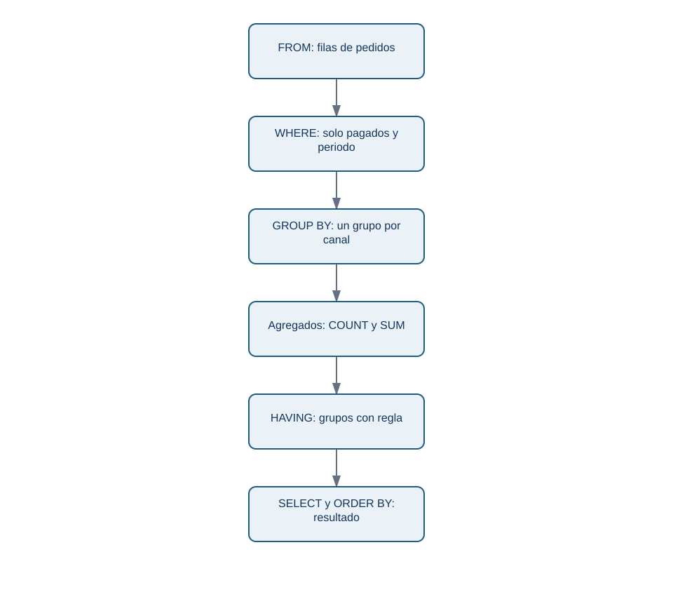
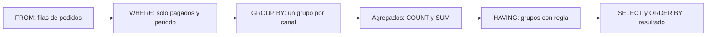

# 02. SQL básico: seleccionar, filtrar y resumir

## Resultado y prerrequisitos

Escribirás una consulta que responda «¿qué pedidos pagados tuvo Lumen por canal?» y explicarás qué filas descarta. Debes saber el grano de las tablas del caso.

## SQL responde una pregunta, no adivina la métrica

**SQL** (Structured Query Language) es un lenguaje declarativo: indicas el conjunto de datos que quieres y el motor decide cómo obtenerlo. Una consulta no es una fórmula mágica: su resultado depende de tabla, filtros, periodo, grano y medida elegidos.

Antes de teclear, escribe un contrato mínimo:

> Pedidos confirmados (`estado = 'pagado'`) creados entre 2026-07-01 inclusive y 2026-07-08 exclusive, una fila final por `canal`; medida: número de `pedido_id`.

La fecha final exclusiva evita ambigüedad con horas. En datos con zona horaria, registra y compara instantes con zona explícita; no arregles el problema convirtiendo una fecha a texto de forma arbitraria.

## SELECT, FROM, WHERE, ORDER BY

```sql
SELECT pedido_id, cliente_id, creado_en, canal
FROM pedidos
WHERE estado = 'pagado'
  AND creado_en >= '2026-07-01'
  AND creado_en <  '2026-07-08'
ORDER BY creado_en, pedido_id;
```

`FROM` elige las filas de partida; `WHERE` conserva solo las que cumplen una condición; `SELECT` muestra o calcula columnas; `ORDER BY` ordena el resultado de presentación. Es útil leer el SQL en este orden lógico, aunque se escriba empezando por `SELECT`.

**Contraejemplo:** `WHERE creado_en = '2026-07-01'` puede no encontrar un instante `2026-07-01T10:15:00Z`. Una fecha de calendario y un instante no son necesariamente el mismo tipo de dato.

## GROUP BY: cambiar el grano de salida

Una agregación reduce varias filas a un resumen. Al agrupar por `canal`, el resultado deja de estar a grano pedido y pasa a grano canal:

```sql
SELECT
  canal,
  COUNT(*) AS filas,
  COUNT(DISTINCT pedido_id) AS pedidos_unicos
FROM pedidos
WHERE estado = 'pagado'
GROUP BY canal
ORDER BY pedidos_unicos DESC;
```

En esta tabla `pedido_id` es PK, por lo que ambos conteos coinciden. Escribir ambos durante una validación hace visible el supuesto. Tras un `JOIN` con líneas, `COUNT(*)` ya contaría líneas combinadas; `COUNT(DISTINCT p.pedido_id)` seguiría contando pedidos.

La diferencia entre filtrar antes y después del resumen es fundamental:

```sql
-- WHERE decide qué pedidos participan.
SELECT canal, COUNT(*) AS pedidos
FROM pedidos
WHERE estado = 'pagado'
GROUP BY canal
HAVING COUNT(*) >= 2;
```

`HAVING` filtra **grupos** ya formados. No uses `HAVING estado = 'pagado'`: es una condición de fila y pertenece a `WHERE`.

## CASE: clasificar sin borrar el dato original

`CASE` crea una categoría calculada. Lumen quiere separar pedidos de importe alto y bajo, pero la regla debe ser visible y revisable:

```sql
SELECT
  CASE WHEN importe_total >= 20 THEN 'alto' ELSE 'habitual' END AS tramo,
  COUNT(*) AS pedidos,
  ROUND(SUM(importe_total), 2) AS ingresos
FROM (
  SELECT p.pedido_id, SUM(l.cantidad * l.precio_unitario) AS importe_total
  FROM pedidos p
  JOIN lineas_pedido l ON l.pedido_id = p.pedido_id
  WHERE p.estado = 'pagado'
  GROUP BY p.pedido_id
) AS pedido_importe
GROUP BY tramo
ORDER BY ingresos DESC;
```

Primero se calcula un importe **por pedido**; después se clasifica. Clasificar directamente cada línea respondería otra pregunta. Si `importe_total` fuese `NULL`, el `CASE` tomaría `ELSE`; decide si esa ausencia significa cero, error o dato pendiente antes de etiquetarla.

## Recorrido de una consulta

La pregunta «¿qué sucede antes de que aparezca el resultado?» se resume así:

<!-- mobile-diagram: rendered fallback -->


<details>
<summary>Ver código Mermaid editable</summary>


</details>

El orden enseña por qué una condición de fila no se comporta igual que una condición de grupo. Un motor puede optimizar internamente el plan, pero el significado lógico debe mantenerse.

## Comprobación y práctica

Antes de confiar en un total, ejecuta una consulta de control: cuenta los pedidos por estado, inspecciona ejemplos de borde y conserva el periodo en el título de la salida. La consulta del laboratorio imprime estas comprobaciones.

Preguntas:

1. ¿Qué diferencia hay entre `COUNT(*)` y `COUNT(DISTINCT pedido_id)` después de unir líneas?
2. ¿Por qué `HAVING` no reemplaza a `WHERE`?
3. ¿Qué grano tiene el resultado de la subconsulta `pedido_importe`?

Continúa con [joins y cardinalidad](03-joins-y-cardinalidad.md), donde el grano puede romperse sin que SQL produzca error.
