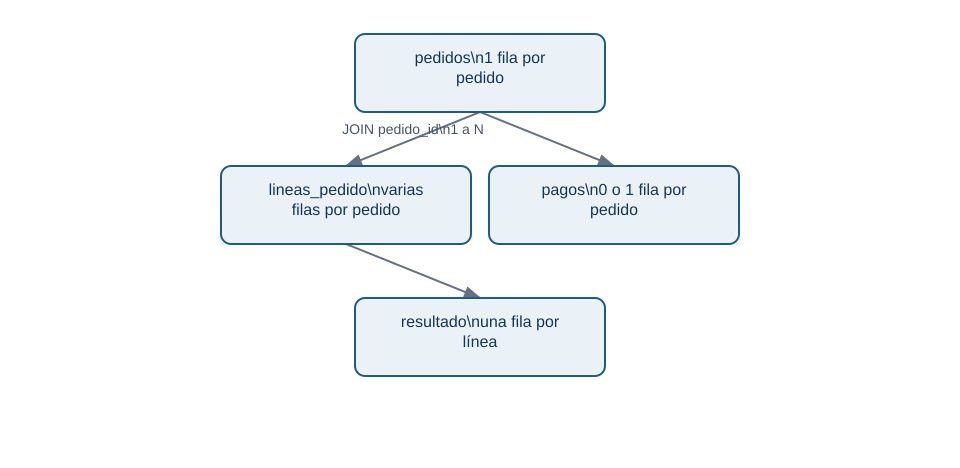
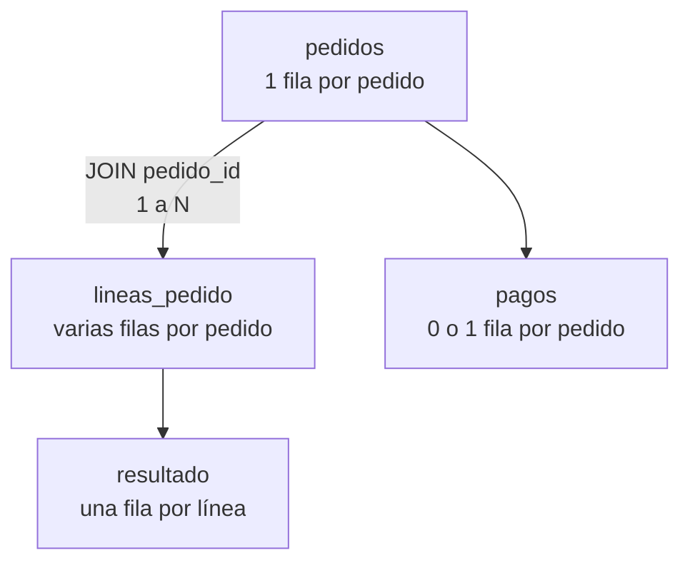

# 03. JOIN, cardinalidad y anti-joins

## Resultado y prerrequisitos

Combinarás tablas de Lumen sin inflar ingresos y localizarás registros sin correspondencia. Debes conocer PK, FK y grano.

## Unir es emparejar, no «añadir columnas»

Un `JOIN` combina una fila izquierda con las filas derechas que satisfacen una condición. La **cardinalidad** describe cuántas coincidencias puede haber: 1:1, 1:N, N:1 o N:M. Declárala antes de ejecutar la consulta; es un supuesto de negocio verificable.

<!-- mobile-diagram: rendered fallback -->


<details>
<summary>Ver código Mermaid editable</summary>


</details>

El resultado de `pedidos JOIN lineas_pedido` está a grano **línea**, no pedido. Por eso `SUM(p.importe_de_pedido)` tras ese join repetiría el importe de cada pedido tantas veces como líneas tenga.

## INNER JOIN y LEFT JOIN

```sql
-- Solo pedidos cuyos clientes existen: útil para medir integridad, pero puede ocultar fallos.
SELECT p.pedido_id, c.pais
FROM pedidos AS p
INNER JOIN clientes AS c ON c.cliente_id = p.cliente_id;

-- Todos los pedidos, también si falta cliente: útil para investigar el fallo.
SELECT p.pedido_id, c.pais
FROM pedidos AS p
LEFT JOIN clientes AS c ON c.cliente_id = p.cliente_id;
```

`INNER JOIN` conserva coincidencias de ambos lados. `LEFT JOIN` conserva todas las filas de la izquierda y pone `NULL` en columnas derechas cuando no hay coincidencia. Elegir uno cambia la población medida; no es una preferencia estética.

## Validar una unión

En una relación N:1 desde pedidos hacia clientes, el número de pedidos no debe aumentar. Convierte ese razonamiento en controles:

```sql
-- Las claves de cliente deben ser únicas antes de la unión.
SELECT cliente_id, COUNT(*) AS n
FROM clientes
GROUP BY cliente_id
HAVING COUNT(*) > 1;

-- Recuento de filas antes y después: debe coincidir para N:1.
SELECT COUNT(*) AS pedidos_antes FROM pedidos;
SELECT COUNT(*) AS pedidos_despues
FROM pedidos p LEFT JOIN clientes c ON c.cliente_id = p.cliente_id;
```

Un resultado vacío en el primer control y recuentos iguales son evidencia de que este aspecto del join es seguro. No prueban que `pais` esté actualizado ni que la definición de cliente sea correcta.

## Agregar antes de unir cuando hace falta

La regla práctica es: si necesitas una métrica por pedido a partir de líneas, agrega las líneas a pedido **antes** de combinarlas con otra relación N.

```sql
WITH importe_por_pedido AS (
  SELECT pedido_id, SUM(cantidad * precio_unitario) AS importe
  FROM lineas_pedido
  GROUP BY pedido_id
)
SELECT c.pais, COUNT(*) AS pedidos, ROUND(SUM(i.importe), 2) AS ingresos
FROM pedidos p
JOIN importe_por_pedido i ON i.pedido_id = p.pedido_id
JOIN clientes c ON c.cliente_id = p.cliente_id
WHERE p.estado = 'pagado'
GROUP BY c.pais;
```

La CTE deja claro que `importe_por_pedido` tiene una fila por pedido. En la siguiente lección se estudia esta construcción con más detalle.

## Anti-join: encontrar lo que falta

Un **anti-join** devuelve filas de un lado que no encuentran pareja en el otro. Es imprescindible para calidad, conciliación y funnels. La forma más clara suele ser `NOT EXISTS`:

```sql
-- Pedidos pagados que no tienen pago liquidado: anomalía a investigar.
SELECT p.pedido_id, p.creado_en
FROM pedidos p
WHERE p.estado = 'pagado'
  AND NOT EXISTS (
    SELECT 1 FROM pagos g
    WHERE g.pedido_id = p.pedido_id AND g.estado = 'liquidado'
  );
```

También puede expresarse con `LEFT JOIN ... WHERE g.pago_id IS NULL`. Evita `NOT IN` si la subconsulta puede contener `NULL`: la lógica ternaria de SQL puede producir un resultado inesperado.

## Error habitual y resumen

**Error:** usar `SELECT DISTINCT` al final para «arreglar» duplicados. Puede ocultar una relación mal modelada y descartar filas legítimas. Primero descubre qué tabla multiplicó las filas y a qué grano debe quedar el resultado.

Preguntas: ¿qué cardinalidad tiene `clientes` hacia `pedidos`? ¿Qué control ejecutarías antes de sumar dinero tras un join? ¿Qué pregunta responde el anti-join de pagos?

En la siguiente lección construirás consultas en pasos, compararás filas con ventanas y validarás un funnel temporal.
