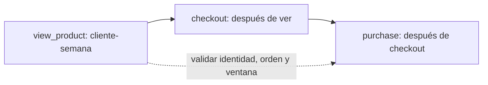

# 04. CTE, ventanas, fechas, nulos y funnel

## Resultado y prerrequisitos

Construirás una consulta analítica por pasos, compararás cada pedido con el anterior de su cliente y medirás un funnel sin contar eventos como personas. Requiere saber agrupar y unir.

## CTE: una consulta que se puede revisar

Una **CTE** (common table expression) da nombre a un resultado intermedio mediante `WITH`. No es automáticamente más rápida: su valor principal para el analista es separar transformaciones con un grano claro.

```sql
WITH pedidos_pagados AS (
  SELECT pedido_id, cliente_id, creado_en
  FROM pedidos
  WHERE estado = 'pagado'
), importe_por_pedido AS (
  SELECT pedido_id, SUM(cantidad * precio_unitario) AS importe
  FROM lineas_pedido
  GROUP BY pedido_id
)
SELECT p.cliente_id, p.pedido_id, i.importe
FROM pedidos_pagados p
JOIN importe_por_pedido i USING (pedido_id);
```

Cada CTE permite comprobar una cosa: `pedidos_pagados` tiene un pedido por fila; `importe_por_pedido` también. Si el resultado es extraño, inspecciona cada CTE por separado antes de añadir más SQL.

## Ventanas: calcular sin perder filas

`GROUP BY` reduce filas; una **función de ventana** calcula sobre un grupo relacionado y conserva el detalle. En Lumen, `ROW_NUMBER()` enumera pedidos de cada cliente y `LAG()` trae el dato anterior según un orden explícito:

```sql
WITH importe AS (
  SELECT pedido_id, SUM(cantidad * precio_unitario) AS total
  FROM lineas_pedido GROUP BY pedido_id
)
SELECT p.cliente_id, p.pedido_id, p.creado_en, i.total,
       ROW_NUMBER() OVER (
         PARTITION BY p.cliente_id ORDER BY p.creado_en, p.pedido_id
       ) AS numero_pedido,
       LAG(i.total) OVER (
         PARTITION BY p.cliente_id ORDER BY p.creado_en, p.pedido_id
       ) AS total_anterior
FROM pedidos p JOIN importe i USING (pedido_id)
WHERE p.estado = 'pagado';
```

`PARTITION BY` reinicia la ventana por cliente; `ORDER BY` define qué significa «anterior». Sin orden completo, dos filas con la misma hora pueden hacer el resultado no determinista. El primer pedido tiene `NULL` en `total_anterior`: significa que no existe uno anterior, no importe cero.

## Fechas y nulos: ausencia no equivale a cero

Una fecha puede ser una fecha de negocio, un instante UTC o la hora local del usuario. Declara cuál usas. Para intervalos, usa extremos como `[inicio, fin)` y deja la zona horaria en el contrato.

`NULL` significa «desconocido, no aplicable o no registrado», según la fuente. `COALESCE(valor, 0)` solo es correcto si una regla de negocio dice que la ausencia representa cero:

```sql
SELECT p.pedido_id, COALESCE(g.importe, 0) AS importe_cobrado
FROM pedidos p LEFT JOIN pagos g USING (pedido_id);
```

En una conciliación financiera, sustituir un pago ausente por cero puede esconder un fallo. Es mejor exponer una columna de estado y tratar la ausencia explícitamente.

## Funnel que conserva su definición

Un **funnel** mide cuántas personas o entidades pasan por pasos ordenados. No es «contar eventos de cada nombre»: una persona puede disparar `checkout_started` repetidamente. El contrato de Lumen es: cliente que hizo `view_product` y, después, `checkout_started` y `purchase` durante la misma semana UTC. Se cuenta una vez por cliente y semana.



Una implementación pedagógica usa la primera hora de cada paso y condiciones de orden:

```sql
WITH por_cliente_semana AS (
 SELECT cliente_id, substr(ocurrido_en, 1, 10) AS dia,
   MIN(CASE WHEN evento = 'view_product' THEN ocurrido_en END) AS vista,
   MIN(CASE WHEN evento = 'checkout_started' THEN ocurrido_en END) AS checkout,
   MIN(CASE WHEN evento = 'purchase' THEN ocurrido_en END) AS compra
 FROM eventos GROUP BY cliente_id, substr(ocurrido_en, 1, 10)
)
SELECT COUNT(*) AS vistas,
 SUM(checkout >= vista) AS checkout_despues_de_vista,
 SUM(compra >= checkout AND checkout >= vista) AS compras_validas
FROM por_cliente_semana WHERE vista IS NOT NULL;
```

Para producción, define semana con una función de calendario del motor, usa una tabla de fechas y decide qué hacer con eventos sin `cliente_id`, duplicados y zonas horarias. El laboratorio muestra ambos conteos para detectar cambios de definición.

## Resumen y controles

Una consulta mantenible declara pasos, granos, orden y significado de ausencias. Comprueba que las etapas del funnel disminuyen, inspecciona IDs de ejemplo y compara el conteo de eventos con el de clientes únicos. Sigue con [MongoDB](05-mongodb-y-documentos.md): cambiar de modelo no elimina estos contratos.
