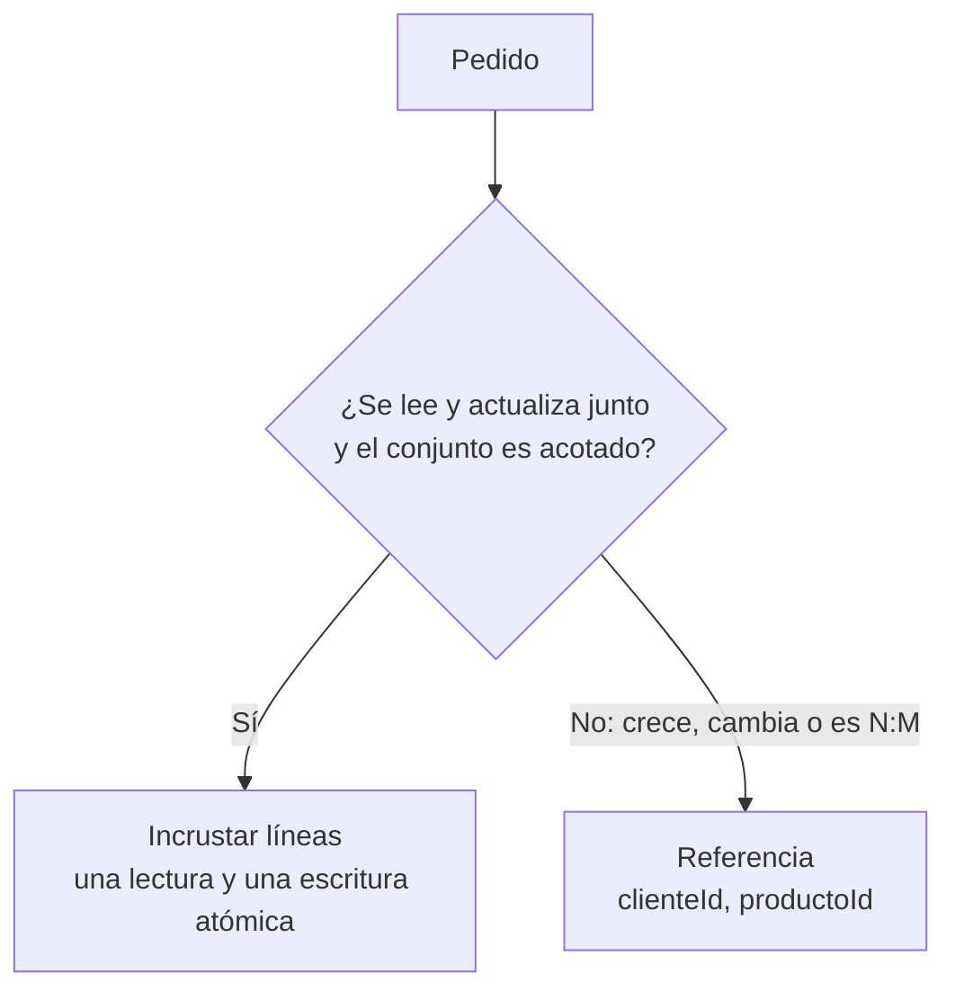

# 05. MongoDB: documentos, pipeline e índices

## Resultado y prerrequisitos

Podrás representar un pedido como JSON, decidir entre incrustar y referenciar, y leer un pipeline de agregación sin confundir flexibilidad con falta de reglas. No hace falta instalar MongoDB.

## Un documento antes que la jerga

Un **documento** es una pieza de información con campos y puede contener objetos o listas. **JSON** es una forma de escribir esa estructura en texto. Para una pantalla de detalle de pedido, resulta natural leer el pedido y sus líneas juntos:

```json
{
  "_id": "P100",
  "clienteId": "C001",
  "creadoEn": "2026-07-01T10:15:00Z",
  "estado": "pagado",
  "lineas": [
    {"producto": "cafe", "cantidad": 2, "precioUnitario": 4.00},
    {"producto": "te", "cantidad": 1, "precioUnitario": 4.40}
  ]
}
```

MongoDB agrupa documentos en **colecciones**. Un documento no requiere que todos tengan exactamente las mismas propiedades, pero una aplicación profesional conserva un contrato: identificadores, tipos, versión de esquema, campos obligatorios y semántica de importes.

## Incrustar o referenciar

La pregunta «¿cuándo conviene guardar juntos los datos relacionados?» tiene dos respuestas posibles:



**Embedding** guarda datos relacionados dentro de un documento y puede servirlos en una sola lectura; es útil para líneas de un pedido cerrado. Las [guías oficiales de MongoDB sobre embedding](https://www.mongodb.com/docs/v8.2/data-modeling/embedding/) recalcan esas ventajas. Usa **referencias** si duplicar sería costoso, los datos cambian con frecuencia, hay relaciones muchos-a-muchos o un arreglo puede crecer sin control; la [documentación oficial](https://www.mongodb.com/docs/manual/data-modeling/referencing/) enumera estos casos.

No copies el precio actual del catálogo para rehacer un pedido histórico. En una línea de pedido normalmente se conserva un *snapshot* del precio vendido; eso es una decisión de negocio documentada, no una propiedad automática de MongoDB.

## Pipeline de agregación

Un **pipeline** procesa documentos por etapas. Este resume ingresos de pedidos pagados; primero filtra, después expande líneas, luego calcula y agrupa:

```javascript
db.pedidos.aggregate([
  {$match: {estado: "pagado", creadoEn: {$gte: ISODate("2026-07-01")}}},
  {$unwind: "$lineas"},
  {$group: {
    _id: "$clienteId",
    ingresos: {$sum: {$multiply: ["$lineas.cantidad", "$lineas.precioUnitario"]}},
    pedidos: {$addToSet: "$_id"}
  }},
  {$project: {ingresos: 1, pedidos: {$size: "$pedidos"}}},
  {$sort: {ingresos: -1}}
]);
```

`$unwind` cambia el grano de pedido a línea, igual que un join 1:N en SQL. Por eso los pedidos se cuentan mediante conjunto de IDs, no con el número de documentos tras la expansión. Añade y prueba índices en los campos de filtro y orden de tus patrones reales; un índice acelera algunas lecturas a cambio de espacio y coste de escritura. Usa `explain()` y datos representativos antes de afirmar que una consulta es rápida.

## AI y controles

Un asistente que genera un pipeline desde lenguaje natural produce un borrador. Verifica colección, periodo, tipo de fecha, grano tras `$unwind`, permisos, índices, coste y ejemplos manuales. Ningún texto generado por AI conoce por defecto qué significa «ingreso» en Lumen.

Preguntas: ¿por qué las líneas de un pedido pueden incrustarse? ¿qué cambia `$unwind`? ¿cuándo una referencia es más segura?

Sigue con [DynamoDB](06-dynamodb-y-patrones-de-acceso.md), donde primero se diseñan los accesos, no las entidades.
