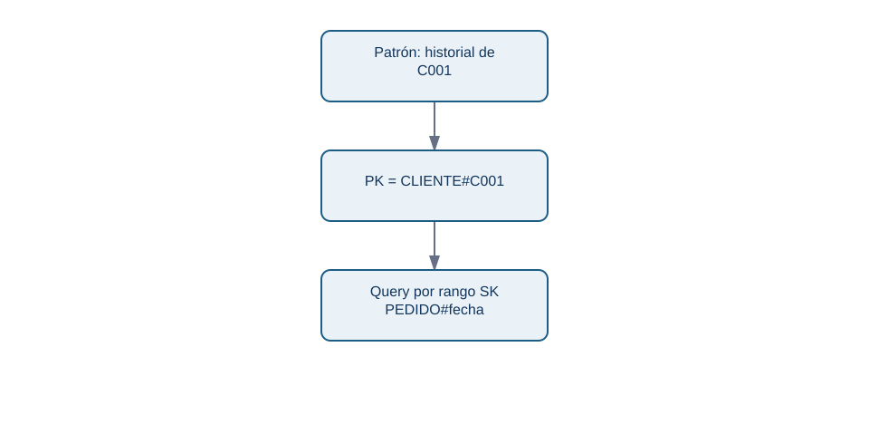
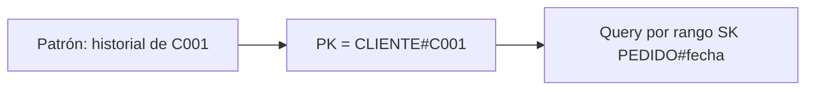

# 06. DynamoDB: patrones de acceso, claves y GSI

## Resultado y prerrequisitos

Propondrás un diseño de DynamoDB para dos lecturas conocidas de Lumen y explicarás qué pregunta analítica no resuelve. Requiere comprender grano y claves; no requiere una cuenta AWS.

## Empezar por la pregunta que ejecuta la aplicación

DynamoDB es una base NoSQL gestionada de clave-valor/documento. En vez de comenzar por un diagrama de entidades ideal, se enumeran **patrones de acceso**: qué se lee o escribe, con qué clave, en qué orden, cuántas veces y con qué latencia.

Para Lumen:

| Patrón | Entrada conocida | Resultado | Frecuencia |
| --- | --- | --- | --- |
| detalle de pedido | `pedido_id` | pedido y líneas | al abrir la pantalla |
| historial de cliente | `cliente_id`, rango fecha | pedidos recientes | al abrir perfil |
| cola de pedidos pagados | fecha/estado | pedidos a preparar | operativo |
| ingresos por país y trimestre | ninguno concreto | agregado histórico | analítico |

Los tres primeros son candidatas a `GetItem` o `Query`. El último necesita explorar muchas particiones y agregación: es trabajo de warehouse, no una razón para hacer `Scan` periódico sobre la tabla operacional.

## Clave primaria compuesta

La clave primaria puede ser simple o compuesta. Una clave compuesta tiene **PK** (partition key) y **SK** (sort key). Las filas con la misma PK forman una colección de ítems y se ordenan por SK. AWS documenta que una PK debe distribuir carga y que la SK permite rangos y relaciones uno-a-muchos: [fundamentos de modelado](https://docs.aws.amazon.com/amazondynamodb/latest/developerguide/data-modeling.html) y [buenas prácticas de sort key](https://docs.aws.amazon.com/amazondynamodb/latest/developerguide/bp-sort-keys.html).

Un diseño posible de tabla única para el historial del cliente es:

| PK | SK | tipo | datos |
| --- | --- | --- | --- |
| `CLIENTE#C001` | `PERFIL` | `CLIENTE` | país, alta |
| `CLIENTE#C001` | `PEDIDO#2026-07-01T10:15:00Z#P100` | `PEDIDO` | total, estado |
| `PEDIDO#P100` | `METADATA` | `PEDIDO` | cliente, total |
| `PEDIDO#P100` | `LINEA#001` | `LINEA` | producto, cantidad |

<!-- mobile-diagram: rendered fallback -->

Ver código Mermaid editable

La pregunta agregada global de la tabla anterior no debe resolverse con un `Scan` periódico: se extrae a OLAP. La SK debe ordenarse para los rangos que realmente se consultan. Una PK con valor muy repetido, como `estado=pagado`, puede concentrar tráfico; AWS recomienda distribuir actividad de forma uniforme y analizar volumen por clave ([partition keys](https://docs.aws.amazon.com/amazondynamodb/latest/developerguide/bp-partition-key-design.html)).

## GSI: otro camino de consulta, no una búsqueda gratis

Un **Global Secondary Index (GSI)** reorganiza ítems con otra clave para soportar un patrón adicional. Para la cola operativa podrías escribir `GSI1PK = ESTADO#pagado#2026-07-01` y `GSI1SK = creado_en#pedido_id`; entonces consultas un día y estado sin recorrer toda la tabla. Un GSI tiene su propio esquema de clave y capacidad; la [documentación oficial](https://docs.aws.amazon.com/amazondynamodb/latest/developerguide/GSI.html) explica sus atributos proyectados y límites de consulta.

Antes de añadirlo pregunta: ¿qué ítems lo tienen?, ¿cuánto escriben?, ¿su PK distribuye carga?, ¿qué atributos necesita la lectura? Un índice de baja cardinalidad puede convertirse en cuello de botella y aumenta coste de escritura.

## Límites y relación con analítica

DynamoDB no ofrece joins arbitrarios ni está pensado para descubrir después cualquier agregación histórica. Desnormalizar para una lectura conocida puede ser correcto en OLTP; para métricas reproducibles exporta cambios a una capa analítica, conserva historia y define transformaciones. No declares que una tabla «es el warehouse» porque guarde muchos datos.

Preguntas: ¿qué patrón justifica un GSI? ¿qué haría peligrosa una PK `ESTADO#pagado`? ¿por qué ingresos trimestrales por país no es una `Query` natural?
