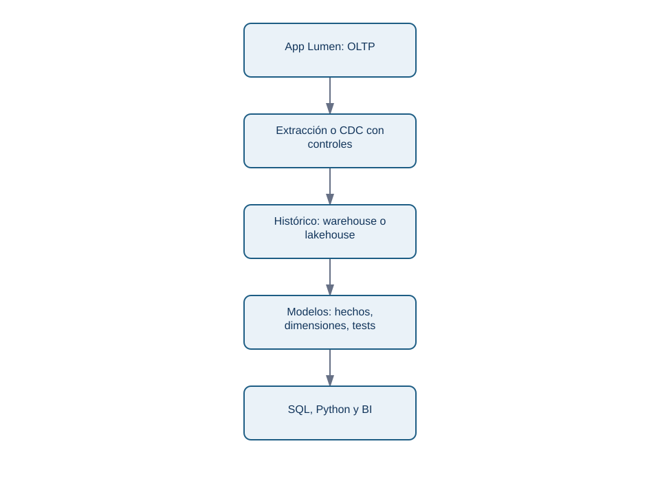
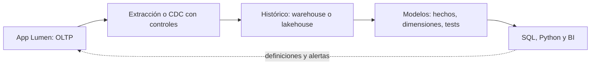
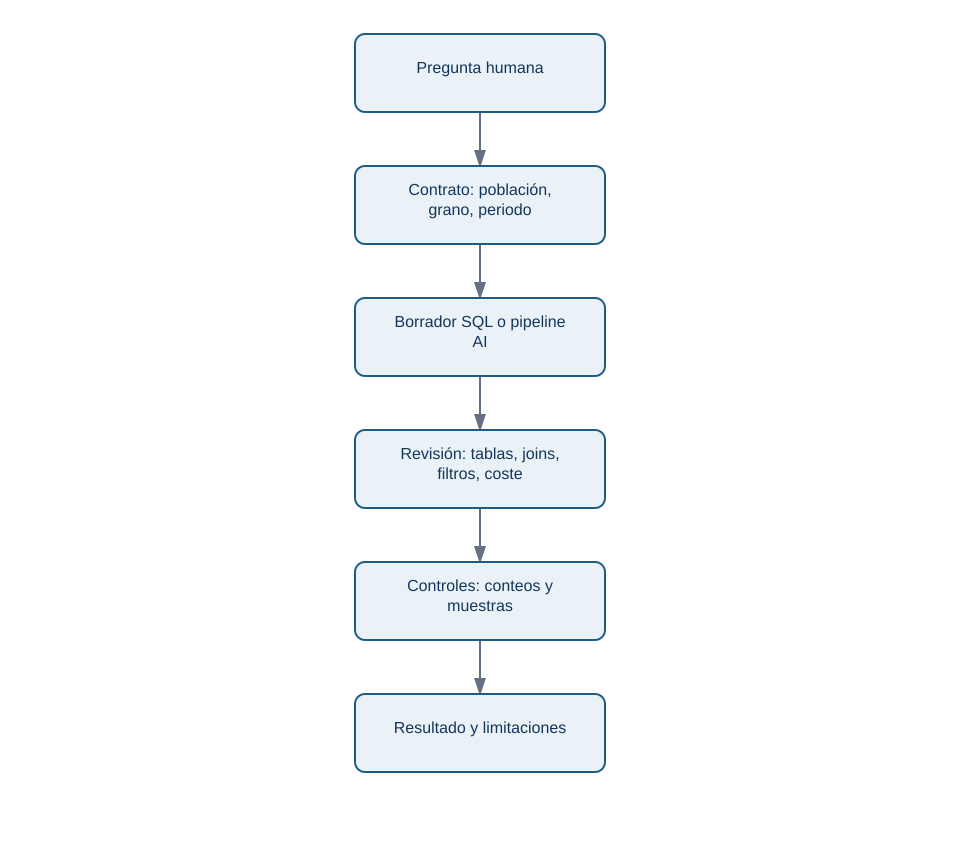
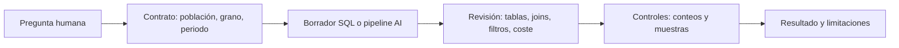

# 07. OLTP, OLAP, warehouse, lakehouse y AI

## Resultado y prerrequisitos

Distinguirás la base que sostiene una operación de la capa que permite analizarla, y revisarás una consulta asistida por AI mediante controles reproducibles.

## Dos trabajos distintos

**OLTP** (procesamiento transaccional en línea) prioriza registrar una operación correcta y rápida: crear pedido, cobrar o mostrar perfil. Sus tablas o ítems suelen estar optimizados para accesos de la aplicación. **OLAP** (procesamiento analítico en línea) prioriza leer muchas observaciones, combinar historia y resumir para responder preguntas. Un análisis de margen trimestral por cohortes no debe competir con la pantalla de pago.

<!-- mobile-diagram: rendered fallback -->

Ver código Mermaid editable

El diagrama no afirma que toda empresa tenga las mismas herramientas. Expresa una separación de responsabilidades: la copia analítica recibe datos, los transforma de forma documentada y sirve decisiones sin alterar el registro operacional.

## Warehouse y lakehouse sin promesas vacías

Un **warehouse** organiza datos limpiados y modelados para análisis; suele exponer tablas de hechos (eventos medibles, como pedido) y dimensiones (contexto, como cliente o calendario). Un **lakehouse** combina almacenamiento de archivos de distintos tipos con capacidades de tabla y consulta analítica. Los nombres comerciales cambian; para el analista importan linaje, calidad, permisos, coste, granularidad y refresco.

Ejemplo: `fact_pedidos` puede tener una fila por pedido pagado, con `dim_fecha` y `dim_cliente` vinculadas. No copies la tabla operacional sin pensar: decide la hora de corte, reembolsos, deduplicación, zona horaria y cómo se corrigen datos tardíos. Eso convierte datos en una fuente defendible.

## Consultas generadas por AI: borrador verificable

Una herramienta puede transformar «ingresos de julio por país» en SQL o MongoDB. Acelera sintaxis, pero no decide qué significa ingreso ni conoce los permisos. Revisa siempre este flujo:

<!-- mobile-diagram: rendered fallback -->

Ver código Mermaid editable

Un checklist mínimo:

1. ¿Usa la tabla certificada y campos con la definición vigente?
2. ¿El grano final coincide con la pregunta? ¿un join multiplica filas?
3. ¿La ventana de fecha, zona y estado de pedidos están explícitos?
4. ¿`NULL`, reembolsos y datos tardíos tienen tratamiento declarado?
5. ¿La ejecución respeta permisos y no expone datos personales innecesarios?
6. ¿Hay conteos intermedios y una muestra manual para contrastar?

## Cierre del bloque

SQL, MongoDB y DynamoDB son herramientas para contratos diferentes. La habilidad profesional es conservar el significado de cada observación desde el evento operacional hasta la métrica. Ejecuta el laboratorio, resuelve el caso evaluable y guarda las consultas con su pregunta, fuente, fecha de ejecución y controles.
