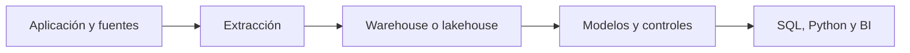

# Warehouse, lakehouse y consultas asistidas

## Objetivos y prerrequisitos

Relacionarás fuentes operacionales con el entorno donde se preparan datos para análisis.

Un sistema operacional registra transacciones para que la aplicación funcione. Un **warehouse** organiza datos históricos y modelados para consulta analítica; un **lakehouse** combina almacenamiento flexible con capacidades analíticas. La arquitectura suele extraer, transformar y documentar datos antes de dashboards, SQL o Python.

La AI puede acelerar un borrador de consulta, pero no conoce por defecto el grano, la semántica, permisos o coste. Contrasta siempre resultado, plan de consulta y definición de métrica.

Resuelve la [consulta de conversión](../../../ejercicios/temario-09/aplicacion/consulta-conversion.md) antes de consultar la solución.
