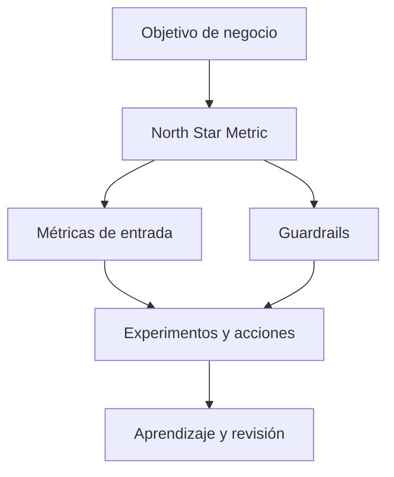

# Bloque 10 - Métricas, KPIs y analítica de producto

## Objetivo

Diseñar métricas que conecten comportamiento, resultados de negocio y decisiones, en lugar de limitarse a contar eventos.

## De objetivo a métrica

Una métrica es una definición reproducible. Un KPI es una métrica elegida para seguir un objetivo importante. Cada definición debe incluir fórmula, población, periodo, fuente, propietario y limitaciones.

## Árboles de métricas

Una North Star Metric resume valor entregado y sostenibilidad, pero no se gestiona sola. Descompónla en métricas controlables: adquisición, activación, engagement, retención y monetización. Añade guardrails para no optimizar crecimiento a costa de fraude, soporte o margen.

## Producto digital

DAU, WAU, MAU, stickiness, conversión, adopción de funcionalidades, retención y churn son útiles solo con definiciones consistentes. En Amplitude estas ideas aparecen como eventos, propiedades, funnels, cohorts, retention y dashboards. Aprende primero el concepto; después cualquier herramienta será más fácil de usar.

## Gobierno de métricas

Un catálogo evita que dos equipos calculen "usuarios activos" de forma diferente. Guarda definición, código, fuente, cambios y usos. Este hábito evita discusiones de números y mejora la confianza.

## Práctica

Diseña [un árbol de métricas](../../ejercicios/temario-10/aplicacion/arbol-metricas.md) y contrástalo con [la propuesta](../../soluciones/temario-10/arbol-metricas.md).
