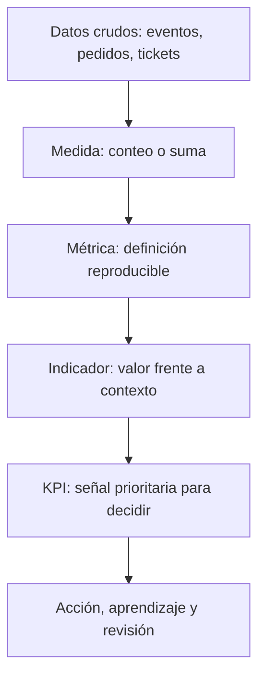

# 10.1 Dato, medida, métrica, indicador y KPI

## Objetivos

Al terminar esta lección podrás diferenciar los cinco términos que más se confunden en una conversación de negocio y detectar por qué una frase como “la métrica ha subido” puede ser inútil si no está definida.

## El problema no es contar; es representar una realidad

Una empresa tecnológica produce muchas huellas: eventos de aplicación, pedidos, tickets de soporte, pagos, campañas y cambios de código. Ninguno de esos registros, por sí solo, responde una pregunta de negocio. El trabajo del analista consiste en convertirlos en una representación explícita y limitada de una realidad: quién hizo qué, cuándo, bajo qué condiciones y por qué nos importa.

Un **dato** es un valor registrado: `usuario_id=42`, `evento="checkout_completed"`, `importe=39.90`. Una **medida** es una operación elemental sobre datos, como contar eventos o sumar importes. Una **métrica** añade una definición reutilizable y un propósito: por ejemplo, “usuarios activos semanales”, calculados como usuarios únicos que realizan una acción de valor entre lunes y domingo. Un **indicador** interpreta una métrica respecto a un contexto: “la activación está 2 puntos por debajo del objetivo”. Un **KPI** es el indicador elegido para gobernar una prioridad importante y al que se asigna responsabilidad y seguimiento.

La flecha no significa que toda medida acabe siendo un KPI. La mayoría no debería serlo. Si una organización convierte cada número visible en un KPI, nadie sabe qué priorizar y se optimizan cifras irrelevantes.

## Ejemplo: “usuarios activos” no es una métrica hasta que la definas

Supón que tres equipos presentan el mismo dashboard. Producto llama activo a quien abre la aplicación; Marketing llama activo a quien recibe un correo; Finanzas llama activo a quien paga. Los tres pueden estar usando datos correctos y aun así discutir sobre cifras incompatibles. El problema no es una fórmula: es una definición incompleta.

Una definición mínima de “usuario activo semanal” podría ser: “usuario identificado que completa al menos una acción de valor entre las 00:00 del lunes y las 23:59 del domingo, en la zona horaria del producto; se excluyen empleados, cuentas de prueba y eventos enviados por sistemas automáticos”. Ahora se puede calcular, discutir y cambiar de forma controlada.

## La métrica no debe sustituir la pregunta

Una métrica es buena cuando ayuda a tomar una decisión. “Número de clics” rara vez es una decisión completa. “Porcentaje de usuarios nuevos que completa el primer proyecto en 7 días, segmentado por plataforma” puede orientar si hay que revisar onboarding, compatibilidad móvil o adquisición.

Antes de aceptar una métrica, plantea estas preguntas:

1. ¿Qué comportamiento o resultado pretende representar?
2. ¿Quién entra en la población y quién no?
3. ¿Qué evento o fuente se considera evidencia?
4. ¿Qué ventana temporal y zona horaria aplican?
5. ¿Qué decisión cambiaría si la métrica mejora o empeora?

Si la quinta pregunta no tiene respuesta, probablemente estás ante una cifra decorativa o exploratoria, no ante un KPI.

## Errores frecuentes

- Llamar KPI a todo lo que aparece en un dashboard.
- Confundir volumen con valor: más registros no implica más clientes satisfechos.
- Comparar métricas con definiciones o periodos distintos.
- Usar una media global cuando segmentos diferentes tienen comportamientos opuestos.
- Olvidar que un dato puede ser correcto técnicamente y engañoso para la decisión.

## Comprobación

Clasifica estas frases: “importe de una transacción”, “ingresos mensuales por cliente activo”, “la retención está por debajo del mínimo aceptable”, “retención a 30 días es un KPI del objetivo de sostenibilidad”. Después explica qué información falta en cada una para que sea reproducible.
