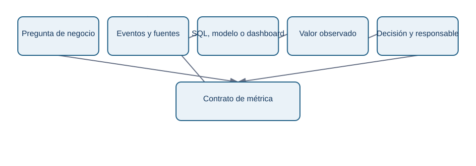
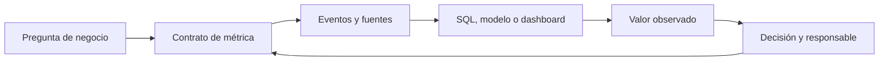

# 10.2 Contrato de una métrica: una definición que otra persona puede repetir

## Objetivos

Aprender a especificar una métrica como un contrato: una pieza de documentación y lógica que permite que producto, datos, finanzas y dirección hablen del mismo número.

## Por qué una fórmula no basta

Escribir `conversion = compras / visitas` parece claro hasta que aparecen preguntas reales: ¿visitas de quién? ¿una visita por sesión, dispositivo o usuario? ¿la compra debe ocurrir el mismo día? ¿se cuentan devoluciones? ¿qué ocurre si el tracking se duplicó durante dos horas? La fórmula es solo una parte de la definición.

Un contrato de métrica elimina ambigüedad antes de que el dashboard llegue a una reunión. Debe ser breve, pero suficiente para que otra persona pueda reproducirla sin interpretar intenciones.

<!-- mobile-diagram: rendered fallback -->

Ver código Mermaid editable

El último retorno importa: una definición no es eterna. Si cambia el producto, el comportamiento de valor o la fuente, se revisa el contrato y se documenta el cambio. No se sobrescribe silenciosamente la historia.

## Los siete campos mínimos

1. **Nombre y propósito.** “Activación a 7 días” y la decisión que pretende informar.
2. **Fórmula.** Numerador, denominador, unidades y tratamiento de cero.
3. **Población.** Quién es elegible, exclusiones y regla de identidad.
4. **Grano.** Usuario, cuenta, pedido, sesión, evento o día.
5. **Ventana temporal.** Inicio, fin, zona horaria y posible retraso de datos.
6. **Fuentes y lógica.** Eventos, tablas, filtros, versión de modelo y reglas de calidad.
7. **Propietario y límites.** Quién responde por la definición y qué no representa la métrica.

## Ejemplo completo: activación de una aplicación B2B

**Propósito:** saber si usuarios nuevos alcanzan el primer resultado de valor durante su primera semana y decidir qué paso de onboarding debe mejorarse.

**Fórmula:** usuarios únicos que crean un proyecto y ejecutan su primera consulta dentro de los siete días siguientes al registro / usuarios nuevos elegibles registrados en el mismo periodo. La métrica se expresa como porcentaje.

**Población:** usuarios humanos con cuenta verificada; se excluyen empleados, sandboxes internas, bots y migraciones masivas. El identificador estable es `account_user_id`.

**Grano y ventana:** cada usuario aporta una vez a su cohorte de registro. El día cero es el día de registro en UTC. Se esperan siete días completos antes de cerrar una cohorte.

**Fuente:** tabla de usuarios para registro, eventos `project_created` y `query_executed` para el criterio de valor. Validaciones: no más de un 1 % de eventos sin identificador y reconciliación diaria con logs de backend.

**Límites:** medir activación no demuestra retención ni satisfacción. Un usuario puede completar la acción por curiosidad y no volver; por eso se acompaña de retención y métricas de calidad.

## Versionado y cambios

Si el producto cambia y ahora una integración automática crea proyectos por el usuario, la definición anterior deja de medir la misma conducta. Mantener la misma etiqueta sin documentarlo rompe comparaciones históricas. Decide entre conservar la versión antigua, crear una v2 o recalcular el histórico si existe una regla equivalente. La elección debe quedar registrada.

## Comprobación

Escribe el contrato de “tasa de conversión de prueba a pago”. Incluye una exclusión razonable, una decisión que informaría y una limitación que impediría interpretarla como salud total del producto.
