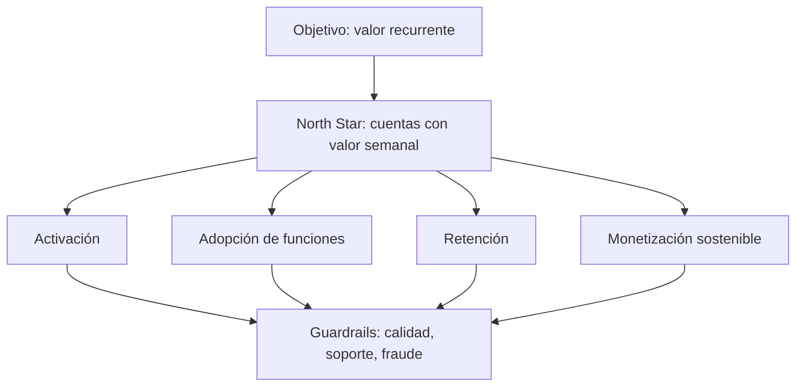

# 10.3 Objetivos, North Star, árboles y guardrails

## Objetivos

Relacionar la estrategia de un producto con métricas operables sin caer en la trampa de gestionar una organización con una única cifra.

## De estrategia a sistema de medida

Un objetivo formula una dirección: “hacer que equipos pequeños obtengan valor recurrente del producto”. Una North Star Metric intenta resumir la entrega de valor de ese objetivo. No sustituye a la estrategia ni resume todas las obligaciones de la empresa; sirve como punto de coordinación.

Una North Star útil debe estar relacionada con valor para el cliente, ser medible con suficiente calidad, responder a acciones de equipos y no ser tan fácil de manipular que incentive un comportamiento dañino. “Usuarios registrados” suele ser demasiado superficial; “cuentas que completan un flujo de valor semanal” suele estar más cerca de la experiencia real, aunque exige una definición cuidadosa.

El árbol no es una cadena causal demostrada automáticamente. Es una hipótesis de negocio: debe contrastarse con análisis, experiencia de producto y experimentos. Su valor está en obligar a explicitar cómo se espera que una acción local contribuya al resultado global.

## Métricas de entrada y de resultado

Las métricas de resultado miran el efecto final: ingresos, retención o valor entregado. Son importantes, pero tardan en cambiar. Las métricas de entrada representan comportamientos o condiciones que un equipo puede influir antes: completar onboarding, tiempo hasta primer valor, cobertura de documentación o tasa de errores.

No elijas una métrica de entrada porque sea fácil de mover. El vínculo con el resultado debe ser plausible y medible. Por ejemplo, aumentar notificaciones enviadas puede mejorar una métrica de actividad a corto plazo y empeorar retención por fatiga.

## Guardrails: progreso sin daño oculto

Un guardrail es una métrica que limita una optimización. Si el objetivo es elevar conversión, guardrails habituales son tasa de devoluciones, tickets de soporte, latencia, fraude, cancelación o satisfacción. No son métricas secundarias: definen qué tipo de éxito es aceptable.

El fenómeno de Goodhart resume el riesgo: cuando una medida se convierte en objetivo, las personas encuentran maneras de mejorarla sin mejorar lo que pretendía representar. Un equipo puede impulsar activación añadiendo un paso obligatorio que dispara el evento de valor, aunque el usuario no haya recibido valor alguno. El árbol de métricas y los guardrails ayudan a detectar esta distorsión.

## Ejemplo de decisión

Un equipo observa menor activación en móvil. Su árbol sugiere revisar el tiempo hasta primer proyecto y el abandono en el permiso de notificaciones. Antes de rediseñar, segmenta por versión, dispositivo y canal; comprueba instrumentación; estima el tamaño de la caída; y decide si necesita un experimento o una corrección técnica. El árbol orienta la investigación, no reemplaza el análisis.

## Comprobación

Para una plataforma de cursos, propone una North Star, tres entradas y dos guardrails. Después describe una forma de manipular la North Star sin generar aprendizaje real y cómo lo detectaría un guardrail.
