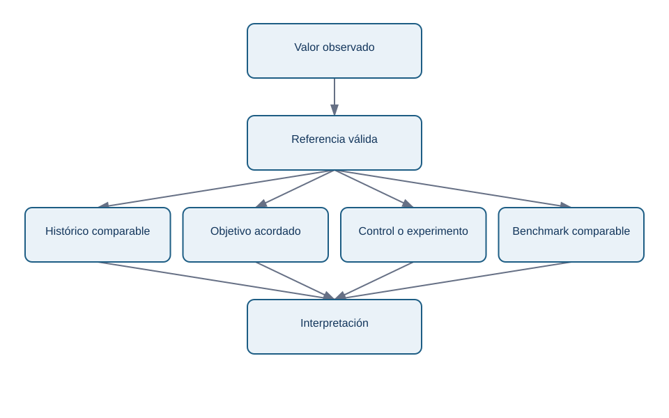
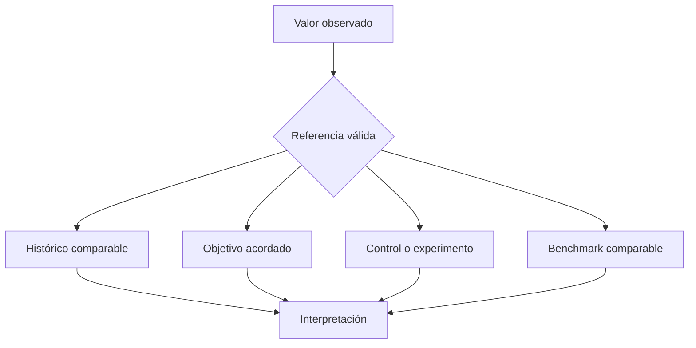

# 10.4 Baselines, objetivos, benchmarks, ratios y comparaciones

## Objetivos

Evitar conclusiones engañosas al comparar una métrica con un periodo, una población o una referencia inadecuados.

## Un número aislado casi nunca informa

Decir “la conversión es 4 %” no permite decidir. ¿Es 4 % frente a un objetivo de 3 % o de 8 %? ¿Sube respecto a la semana anterior? ¿La semana anterior tenía una campaña, una caída de tracking o un festivo? Toda métrica necesita una referencia: baseline histórico, objetivo acordado, benchmark externo comparable o grupo de control.

<!-- mobile-diagram: rendered fallback -->

Ver código Mermaid editable

Un benchmark externo puede orientar, pero rara vez es una meta automática: modelo de negocio, mercado, madurez, definición y población pueden diferir. Es más riguroso usarlo para plantear preguntas que para declarar éxito o fracaso.

## Absoluto, relativo y normalizado

Una caída de 200 conversiones puede ser enorme para un producto pequeño y trivial para otro. Por eso se combinan recuentos absolutos, tasas, cambios porcentuales y, cuando procede, normalización por población o exposición. La tasa de conversión necesita denominador; los ingresos por usuario necesitan periodo y población; la disponibilidad necesita duración observada.

Evita comparar porcentajes cuando los denominadores son minúsculos. Pasar de 1 a 2 compras es un aumento del 100 %, pero no justifica el mismo lenguaje que pasar de 10 000 a 20 000. Comunica ambos valores.

## Segmentos y paradojas

La media global puede mejorar mientras todos los segmentos relevantes empeoran, si cambió la composición de la población. Divide por canal, plataforma, cohorte, región o plan cuando exista una razón de negocio. Pero no busques segmentos hasta encontrar uno “significativo”: define previamente cuáles son plausibles y documenta exploraciones adicionales.

## Comprobación

Una conversión mensual sube del 3 % al 4 %. Escribe cinco datos que pedirías antes de celebrar la mejora y una manera de comunicarla sin exageración.
