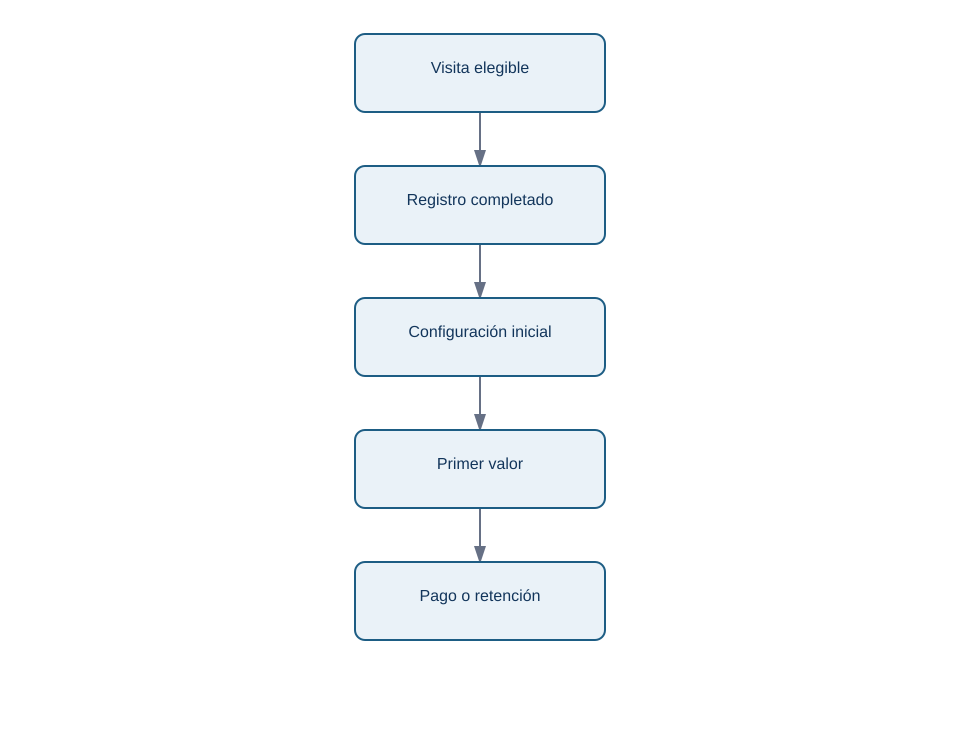
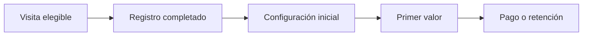

# 10.5 Funnels: definición, instrumentación y diagnóstico de conversión

## Objetivos

Construir un funnel que represente un recorrido real del usuario y diagnosticar pérdidas sin confundir eventos técnicos con progreso de valor.

## Qué mide un funnel

Un funnel compara cuántas entidades pasan por una secuencia de pasos definidos. La entidad puede ser usuario, cuenta, pedido o sesión; escogerla cambia la respuesta. Un funnel de onboarding por usuario y un funnel de checkout por pedido no son intercambiables.

<!-- mobile-diagram: rendered fallback -->

Ver código Mermaid editable

Cada flecha es una hipótesis sobre un recorrido. Define orden, ventana máxima, repetición de eventos, exclusiones y tratamiento de usuarios que entran a mitad del proceso. Si una persona completa pasos en varios dispositivos, necesitas una regla de identidad antes de calcular.

## Pérdida no significa causa

Que el mayor abandono ocurra entre B y C no demuestra que el formulario sea el problema. Puede haber tráfico de baja intención, una incompatibilidad de navegador, un cambio de precio o un evento que no se está registrando. El funnel localiza dónde investigar; logs, sesiones, segmentación, cualitativo o experimentos ayudan a explicar por qué.

## Instrumentación mínima

Para cada paso documenta nombre, condición de éxito, propiedades, cuándo se envía el evento y qué sistemas pueden generarlo. Distingue “botón pulsado” de “acción completada en backend”. El primer evento mide intención; el segundo confirma resultado. Ambos pueden ser útiles, pero responden preguntas distintas.

## Ejemplo de diagnóstico

Si la conversión cae solo en Android tras una versión, compara el funnel por versión de app, modelo de dispositivo y error técnico. Si el evento de “registro completado” cae pero las cuentas existen en base de datos, el problema puede ser instrumentación. La investigación responsable informa de ambas posibilidades antes de atribuir culpa al producto.

## Comprobación

Define un funnel de compra de suscripción. Indica entidad, pasos, ventana y un evento técnico que no usarías como criterio final de conversión.
