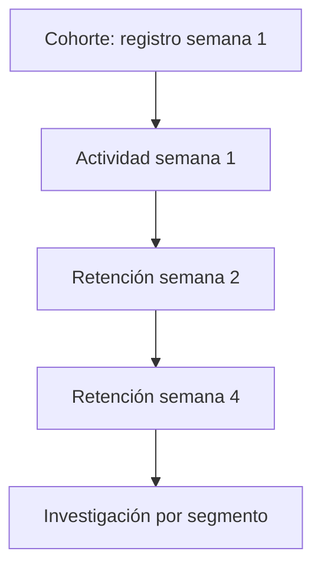

# 10.6 Cohortes, retención, churn y segmentación

## Objetivos

Interpretar cuándo una población vuelve, se mantiene o abandona, y evitar comparar cohortes que no son equivalentes.

## La cohorte da contexto temporal

Una cohorte agrupa entidades que comparten una condición de entrada: por ejemplo, usuarios registrados en la misma semana o cuentas que activaron una funcionalidad. La retención pregunta qué proporción vuelve a realizar una acción definida después de esa entrada. Sin cohorte, una media de usuarios activos mezcla generaciones de producto, campañas y antigüedad.

Define con precisión evento de entrada, evento de retorno, intervalo y tipo de retención. La retención clásica exige volver en un periodo concreto; la no acotada permite volver en o después de cierto día. Ambas son válidas si se nombran correctamente.

## Churn no es simplemente “no activo”

Churn puede referirse a cancelación contractual, inactividad durante un umbral o pérdida de ingresos. Un SaaS anual y una app gratuita no usan la misma definición. Declara el horizonte y la población: una cuenta que aún no tuvo oportunidad razonable de renovar no debe entrar en una tasa de cancelación.

## Segmentación con propósito

Segmenta cuando exista una hipótesis operativa: canales que traen usuarios de distinto valor, planes con onboarding distinto, países con diferencias regulatorias o cuentas con distintos tamaños. No uses segmentos como excusa para ocultar la métrica global; combina ambos niveles y declara denominadores.

## Comprobación

Compara dos cohortes con retención día 30 del 20 % y 25 %. Enumera información necesaria antes de afirmar que la segunda experiencia de onboarding es mejor.
