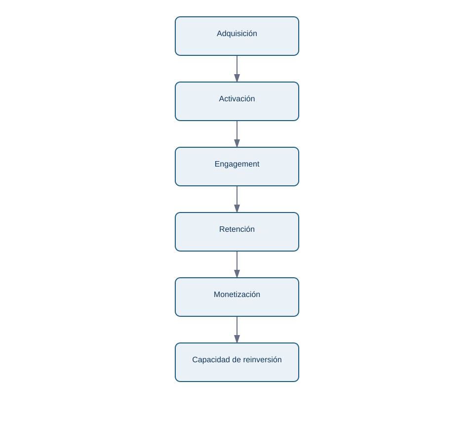
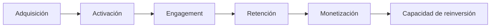

# 10.7 Adquisición, engagement, monetización y valor

## Objetivos

Relacionar métricas de distintas etapas del producto sin convertirlas en una colección desconectada de siglas.

## El recorrido económico y de valor

Adquisición responde quién llega; activación responde quién obtiene primer valor; engagement responde con qué frecuencia y profundidad se usa; retención responde quién vuelve; monetización responde qué valor económico sostiene el servicio. No existe una secuencia universal, pero dibujar la relación evita optimizar una etapa contra otra.

<!-- mobile-diagram: rendered fallback -->

Ver código Mermaid editable

DAU, WAU y MAU son recuentos de actividad; el cociente DAU/MAU se usa a veces como aproximación a frecuencia, pero solo es interpretable con una definición de actividad estable. ARPU, CAC y LTV ayudan a hablar de economía unitaria, pero dependen de costes, horizontes y atribución. No los presentes como verdades universales.

La métrica de valor más útil no siempre es ingreso. En un producto B2B puede ser informes entregados; en una plataforma educativa, actividades significativas completadas; en una infraestructura, tareas ejecutadas con éxito. El valor debe conectar una necesidad del usuario con una viabilidad de negocio.

## Comprobación

Elige un producto y propone una métrica de valor, una de engagement, una de monetización y una advertencia sobre la relación entre ellas.
