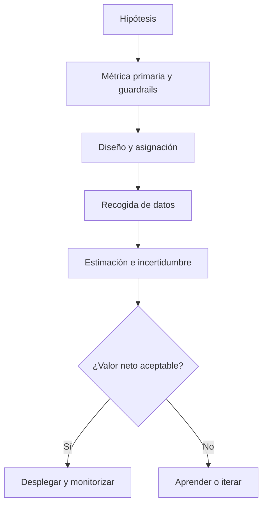

# 10.8 Experimentación, Goodhart y decisiones bajo incertidumbre

## Objetivos

Usar métricas para evaluar cambios sin convertir una mejora puntual en una certeza ni incentivar comportamientos que dañen el producto.

## Antes del experimento

Define hipótesis, población, métrica primaria, guardrails, duración y criterio de decisión antes de mirar los resultados. Si la métrica cambia después de conocer los datos, aumentas la probabilidad de encontrar una historia convincente pero falsa.

La estadística ayuda a medir incertidumbre; no decide por sí sola. Una diferencia puede ser compatible con ruido, demasiado pequeña para justificar coste o perjudicial en un segmento. Comunica magnitud absoluta, relativa, intervalo, tamaño de muestra, duración y límites.

## Goodhart en la práctica

Una medida se degrada cuando las personas optimizan el indicador en vez del fenómeno. Ejemplos: forzar clics para elevar engagement, retrasar una cancelación para reducir churn del mes, o dividir un ticket para mejorar tiempo de primera respuesta. Los guardrails, auditorías cualitativas y métricas complementarias no eliminan el riesgo, pero lo hacen visible.

## Comprobación

Propón un experimento para elevar activación. Incluye métrica primaria, dos guardrails, decisión de parada y una posible forma de Goodhart.
