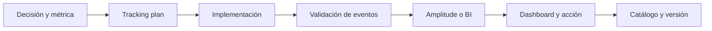

# 10.9 Catálogo de métricas, tracking plan y Amplitude

## Objetivos

Comprender que la confianza en un dashboard depende de un sistema de gobierno: definiciones, eventos, propiedad, cambios y calidad.

## Catálogo de métricas

Un catálogo es el lugar donde se encuentran nombre, propósito, definición, fórmula, fuentes, propietario, versiones, dashboards y consumidores de una métrica. Evita que cada equipo reconstruya “usuarios activos” desde cero y permite investigar diferencias de forma trazable.

## Tracking plan

Antes de instrumentar, documenta qué eventos representan interacciones importantes, qué propiedades permiten segmentar y cómo se identifica a usuario, cuenta o dispositivo. Define también eventos prohibidos: no envíes PII innecesaria a herramientas de analítica. El plan debe incluir validación de cobertura y un proceso de cambio cuando el producto evolucione.

## Amplitude como ejemplo, no como sustituto del criterio

Amplitude permite trabajar con eventos, propiedades, funnels, cohorts, retención y dashboards. Eso no le concede autoridad sobre la definición: una visualización correcta sobre eventos mal instrumentados sigue siendo engañosa. Valida primero identidad, latencia, duplicados, eventos de servidor frente a cliente y cambios de versión.

Una práctica sana consiste en revisar cada métrica con tres capas: definición de negocio, lógica técnica y comportamiento observado. Si las tres no coinciden, el trabajo no está terminado.

## Comprobación

Escribe tres eventos y dos propiedades para medir activación de un producto. Indica qué dato no recogerías por privacidad y cómo comprobarías que el evento llega correctamente.
