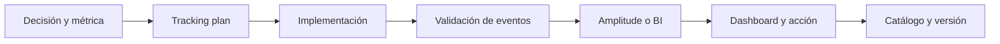
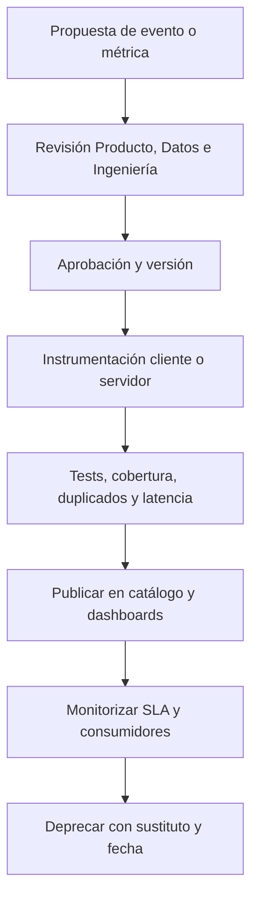

# 10.9 Catálogo de métricas, tracking plan y Amplitude

## Objetivos

Comprender que la confianza en un dashboard depende de un sistema de gobierno: definiciones, eventos, propiedad, cambios y calidad.

## Catálogo de métricas

Un catálogo es el lugar donde se encuentran nombre, propósito, definición, fórmula, fuentes, propietario, versiones, dashboards y consumidores de una métrica. Evita que cada equipo reconstruya “usuarios activos” desde cero y permite investigar diferencias de forma trazable.

## Tracking plan

Antes de instrumentar, documenta qué eventos representan interacciones importantes, qué propiedades permiten segmentar y cómo se identifica a usuario, cuenta o dispositivo. Define también eventos prohibidos: no envíes PII innecesaria a herramientas de analítica. El plan debe incluir validación de cobertura y un proceso de cambio cuando el producto evolucione.

## Amplitude como ejemplo, no como sustituto del criterio

Amplitude permite trabajar con eventos, propiedades, funnels, cohorts, retención y dashboards. Eso no le concede autoridad sobre la definición: una visualización correcta sobre eventos mal instrumentados sigue siendo engañosa. Valida primero identidad, latencia, duplicados, eventos de servidor frente a cliente y cambios de versión.

Una práctica sana consiste en revisar cada métrica con tres capas: definición de negocio, lógica técnica y comportamiento observado. Si las tres no coinciden, el trabajo no está terminado.

## Operar el tracking plan, no archivarlo

Un tracking plan útil se parece a un contrato de API: cada cambio tiene autor, revisión, versión y consumidores conocidos. Para cada evento define nombre estable, descripción de negocio, emisor, identificadores, propiedades con tipo y valores permitidos, clasificación de privacidad, fecha de alta, propietario y estado (`propuesto`, `activo`, `deprecado` o `retirado`). La convención de Lumen usa verbos pasados en `snake_case`: `source_connected`, no una mezcla de `Source Connected`, `connect_source` y `sourceConnect`.

La instrumentación no termina en el frontend. Un cliente puede emitir una intención; el servidor debe confirmar operaciones que cambian estado. Ambos pueden enviarse, pero con fuentes explícitas y un `event_id` o `request_id` que permita detectar reintentos. Registra `occurred_at` en UTC y `received_at` por separado: si una aplicación offline envía tarde, la actividad ocurrió antes aunque llegue hoy. Deduplica por `event_id`, no por «dos filas parecidas».

El diagrama responde a quién impide que una modificación local rompa una serie histórica: ninguna persona aprueba en solitario. Producto valida el significado; Ingeniería, la emisión; Datos, el modelo y las pruebas; Privacidad, las propiedades sensibles. Por ejemplo, un SLA puede exigir que el propietario investigue cobertura inferior al 99,5 % en un día laborable y que una definición nueva se anuncie antes de entrar en el dashboard ejecutivo.

### Amplitude: qué verificar hoy

Amplitude Data permite crear un plan antes de instrumentar, declarar fuentes, tipos y reglas de propiedades, y entregar el contrato a desarrollo. Su documentación recomienda planificar proactivamente y describe fuentes como Web, iOS, Android o Backend. También permite marcar eventos y propiedades revisados como **Official**: es una señal de confianza, no una transformación de los datos ni una prueba de que la métrica sea correcta. Consulta las fuentes primarias: [crear un tracking plan](https://amplitude.com/docs/data/create-tracking-plan), [planificar taxonomía](https://amplitude.com/docs/data/data-planning-playbook) y [eventos y propiedades oficiales](https://amplitude.com/docs/data/official-events-and-properties).

Para vigilancia, Amplitude Observe compara el flujo con el plan y clasifica eventos como válidos, inesperados, inválidos o desactualizados. Es útil como alarma de esquema, pero no sustituye conciliaciones con tablas transaccionales ni pruebas de negocio. La guía oficial de [monitorización de eventos](https://amplitude.com/docs/data/validate-events) explica esos estados. Si se manejan propiedades personales o sensibles, clasifícalas y limita acceso; revisa también la documentación de [Data Access Control](https://amplitude.com/docs/data/data-access-control). Los nombres, pantallas y permisos del producto pueden cambiar: estas referencias son la autoridad, no una captura estática del curso.

### Retirada segura

No borres `report_published` porque aparezca una versión nueva. Marca el evento antiguo como deprecado, documenta `report_published_v2` y el motivo, publica una fecha de migración, localiza dashboards y consultas consumidoras, y solo después bloquea nuevas emisiones. Conserva la definición histórica para interpretar las series anteriores. «Renombrar» sin migración es cambiar el pasado de forma silenciosa.

## Comprobación

Escribe tres eventos y dos propiedades para medir activación de un producto. Indica qué dato no recogerías por privacidad y cómo comprobarías que el evento llega correctamente.
