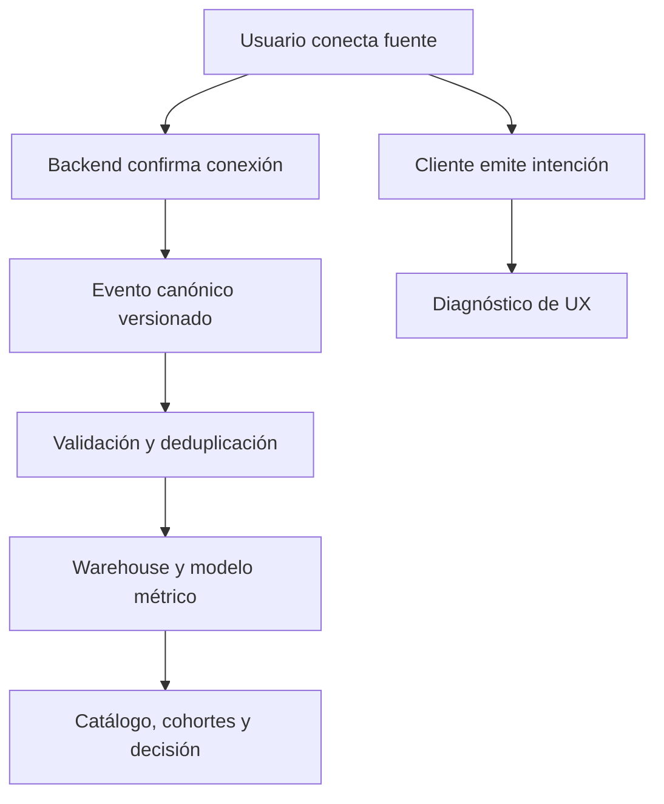

# 10.10 Caso continuo: operar las métricas de un SaaS B2B

## Objetivo y prerrequisitos

En esta lección conviertes una pregunta de dirección en un sistema medible y auditable. Partimos de Lumen, un SaaS B2B que permite a equipos de operaciones conectar fuentes y entregar informes. Necesitas las ideas de contrato, funnel, cohorte y métricas de valor de las lecciones anteriores. El resultado observable es poder decidir si conviene corregir el onboarding, invertir en adquisición o intervenir sobre cuentas en riesgo, explicando qué evidencia falta.

## La pregunta que evita un dashboard decorativo

Lumen tiene 120 cuentas de prueba nuevas al mes, pero Dirección no sabe si el cuello de botella es captación, activación o uso recurrente. La pregunta correcta no es «¿cuál es nuestro DAU?», sino: **¿qué cuentas alcanzan valor en 14 días, qué cohortes lo mantienen y qué acción tiene sentido esta semana?**

Primero fijamos cuatro contratos versionados. `v1.0` significa que los números se pueden comparar entre sí mientras no cambie una regla; una modificación material crea `v1.1` o `v2.0`, con fecha efectiva y nota de impacto.

| Métrica v1.0 | Entidad y fórmula | Ventana / exclusiones | Propietario y decisión |
| --- | --- | --- | --- |
| Activación 14d | cuentas con `source_connected` y `report_published` ordenados / cuentas de prueba elegibles | 14 días desde `workspace_created`; excluir demo, empleados y bots | Producto; priorizar paso con pérdida verificable |
| Retención S4 | cuentas de una cohorte con evento de valor en semana 4 / cuentas con 4 semanas completas | semana 22–28 desde alta; no incluir cohortes inmaduras | Customer Success; contactar riesgo real |
| WAU/MAU | cuentas con valor semanal / cuentas con valor mensual | UTC, evento de valor definido arriba | Producto; comprobar frecuencia, no satisfacción |
| Churn de logos | cancelaciones efectivas / cuentas activas al inicio | mes de cancelación; separar downgrade | Finanzas; previsión de ingreso y capacidad |

Una cuenta puede tener varios usuarios. Si el producto genera valor para la empresa, la cuenta es el denominador de activación y retención; un análisis de adopción individual puede ser una métrica complementaria, nunca una mezcla silenciosa.

## De la acción del usuario al número fiable

La siguiente arquitectura responde a «¿dónde se puede romper el significado de la métrica?». Las ramas representan fuentes diferentes; no son pasos intercambiables.

El clic del cliente explica intención y experiencia; la confirmación del servidor confirma una operación. Para activación usamos el evento canónico de backend. Si ambas fuentes se envían, deben poder relacionarse mediante `request_id` o `event_id`; no se suman como si fueran dos acciones. El flujo también muestra por qué un dashboard no es la fuente de verdad: depende de la semántica anterior.

### Contrato de evento: `report_published` v1.0

| Campo | Regla | Motivo |
| --- | --- | --- |
| Nombre | `report_published`, minúsculas y `snake_case` | evita que `Report Published` y `report_published` sean eventos distintos |
| Emisor | API backend tras persistir el informe | mide éxito, no intención |
| Identidad | `account_id` obligatorio; `user_id` si se conoce; nunca email | permite B2B y minimiza PII |
| Tiempo | `occurred_at` UTC; `received_at` separado | distingue retraso de actividad histórica |
| Idempotencia | `event_id` UUID estable por operación | reintentos no inflan el numerador |
| Propiedades | `plan_tier`, `report_type`, `schema_version` | segmentación limitada y documentada |
| Privacidad | no título, contenido, email ni IP sin necesidad aprobada | el dato accesible no implica dato lícito o útil |

Un contrato también especifica calidad: cobertura esperada de `account_id` >= 99,5 %, retraso p95 inferior a 15 minutos y duplicados de `event_id` inferiores a 0,1 %. Si falla un umbral, el dashboard debe mostrar estado degradado, no una cifra aparentemente precisa.

## Identidad, retrasos y pruebas de instrumentación

En el navegador puede existir `anonymous_id` antes del login. Tras autenticarse se asocia al `user_id`; para análisis de empresa se vincula además a `account_id`. No sustituyas retrospectivamente identificadores sin registrar la regla: un merge erróneo puede atribuir actividad de una cuenta a otra. Las operaciones de servidor que no tienen usuario humano conservan `account_id` y usan un tipo de actor explícito, por ejemplo `actor_type=service`.

Las pruebas mínimas antes de publicar una versión son:

1. **Contrato:** el SDK o la API rechaza nombre, tipo, propiedad obligatoria o versión inválidos.
2. **Camino feliz:** crear espacio, conectar fuente y publicar informe produce exactamente un evento canónico por operación.
3. **Reintento:** reenviar la misma petición con el mismo `event_id` no cambia el recuento único.
4. **Conciliación:** el número de informes publicados en eventos coincide, dentro del SLA, con la tabla transaccional de informes.
5. **Retraso:** un evento recibido mañana pero ocurrido hoy entra en la fecha de actividad de hoy y se vuelve a calcular la ventana afectada.

## Gobernanza: cambio, aprobación y retirada

Una métrica o evento no se modifica desde un dashboard. El solicitante abre una propuesta con propósito, contrato, ejemplo y análisis de consumidores. Producto valida semántica; Ingeniería valida emisión y coste; Datos valida modelo, calidad y migración; Privacidad aprueba propiedades sensibles. La aprobación publica una nueva versión y un propietario con SLA: por ejemplo, Datos investiga alertas de cobertura en un día laborable y Producto comunica cambios de definición antes de la siguiente reunión semanal.

La retirada sigue una secuencia: marcar **deprecado**, avisar dashboards y equipos, ofrecer sustituto y fecha de fin, medir consumidores, bloquear emisiones nuevas y conservar la definición histórica. Borrar o renombrar silenciosamente destruye tendencias y confianza.

## Decisión trabajada

El script del bloque calcula en un conjunto pequeño: 10 cuentas elegibles, 5 conectan fuente, 4 se activan y 3 vuelven en semana 4. La activación es 40 % y la retención S4 observada es 30 %. Antes de rediseñar el editor, se observa que cinco de las seis cuentas no activadas no llegaron a `source_connected`; la decisión razonable es investigar la conexión por proveedor y errores de backend. No es legítimo afirmar que «el editor causa el abandono»: aún no aislamos canal, plan, versión ni causalidad.

## Resumen y comprobación

Una métrica operable necesita entidad, tiempo, versión, fuente, propietario y decisión. La instrumentación es parte del producto: nombra de forma consistente, une identidades con cuidado, deduplica, mide retrasos y prueba el contrato. La gobernanza mantiene ese significado cuando la empresa cambia.

1. ¿Por qué `click_connect_source` no sirve como criterio final de activación?
2. Si llega un evento atrasado, ¿qué fecha debe usar una cohorte y qué debe recalcularse?
3. Propón un SLA y un umbral de calidad para una métrica que usarías en una reunión ejecutiva.

Realiza ahora el [ejercicio de funnel, cohorte y decisión](../../../ejercicios/temario-10/aplicacion/funnel-cohorte-y-decision.md) y ejecuta el [script](../../../notebooks/practicas/10-metricas-producto-b2b.py).
