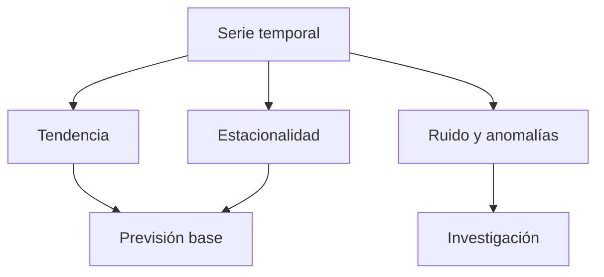

# Bloque 11 - Series temporales

## Objetivo

Analizar datos que cambian con el tiempo, distinguir tendencia de estacionalidad y construir previsiones base honestas.

## Componentes temporales

Una serie puede contener tendencia, estacionalidad, ciclos, ruido y cambios de nivel. Antes de modelar, comprueba frecuencia, fechas ausentes, cambios de definición y eventos externos que hayan alterado la métrica.

## Validación temporal

No mezcles futuro y pasado al evaluar un modelo. Entrena con periodos anteriores y valida con periodos posteriores. Una previsión ingenua, como repetir el último valor o el mismo día de la semana anterior, es una referencia obligatoria.

## Comunicación

Una previsión es un rango con supuestos, no una cifra mágica. Explica horizonte, error esperado, eventos no incluidos y qué decisión cambia si la previsión falla.

## Práctica

Plantea [una previsión de demanda](../../ejercicios/temario-11/aplicacion/prevision-demanda.md) y compara con [la guía](../../soluciones/temario-11/prevision-demanda.md).
