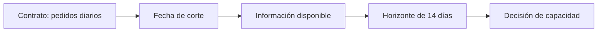

# Contrato de previsión y calidad temporal

## Objetivos y prerrequisitos

Definirás qué se predice, cuándo se predice y qué datos son legítimos antes de mirar un gráfico o elegir un modelo.

Una **serie temporal** es una medida observada en momentos ordenados. En Lumen una fila representa un día; la variable objetivo es el número de `pedidos_completados`; la frecuencia es diaria; la zona es `Europe/Madrid`; el horizonte son los 14 días siguientes; y la fecha de corte es el domingo a las 23:59. Operaciones decide cuántos repartidores reservar el lunes usando solo información anterior al corte.

Esto responde a la pregunta “¿qué contrato evita que una previsión sea una cifra sin contexto?”

El diagrama es una secuencia de decisión: no se puede usar una campaña conocida el miércoles para predecir el lunes anterior. El contrato hace visible el momento en que el dato se vuelve utilizable.

Antes de modelar, construye un calendario completo. Un día sin fila puede significar cero pedidos, una caída del sistema de captura o una fuente incompleta; son tres hechos distintos. Comprueba duplicados, zona horaria, horas de cambio estacional, cobertura, agregación y cambios de definición. Si desde julio “pedido completado” excluye pedidos parcialmente reembolsados, no compares niveles sin documentar la ruptura.

Ejemplo mínimo: si el 6 de enero no aparece en el archivo, no rellenas automáticamente con cero. Primero contrastas el registro operacional; solo después decides si es un cero real, un ausente o un día que debe excluirse.

## Resumen

Una serie fiable empieza por un contrato, un calendario y una métrica estable. Continúa con [tendencia, estacionalidad y rupturas](02-componentes-de-una-serie.md).
