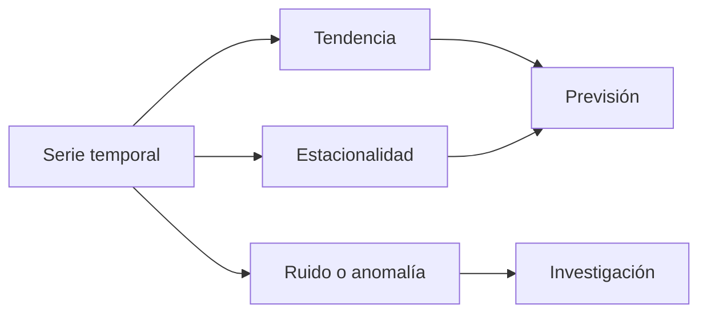

# Tendencia, estacionalidad y cambios

## Objetivos y prerrequisitos

Distinguirás patrones sostenidos de repeticiones de calendario, ruido y cambios de nivel.

Una serie puede contener **tendencia** (movimiento de largo plazo), **estacionalidad** (patrón que se repite por día, semana o año), ruido y rupturas. Una caída de lunes a domingo puede ser normal; una caída frente al mismo lunes de semanas comparables merece investigación.

Descomponer no prueba causas. Un cambio de nivel puede coincidir con una campaña, una incidencia, un festivo o un error de medición. Cruza eventos y segmentos antes de explicarlo.

## Resumen

Compara contra referencias temporales adecuadas, no solo contra el periodo anterior.
