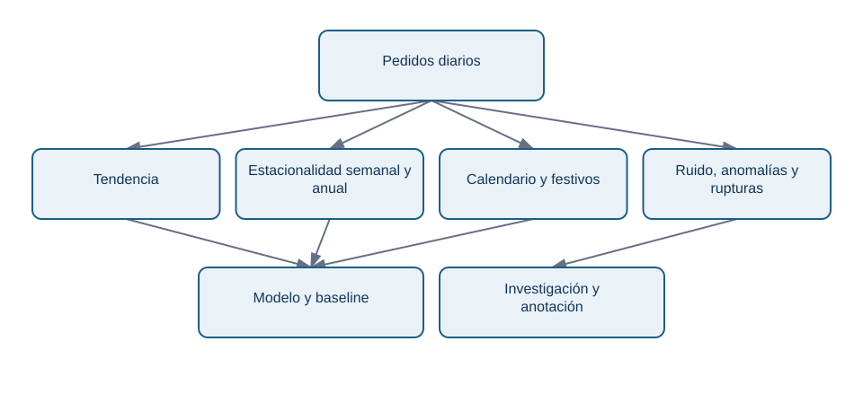
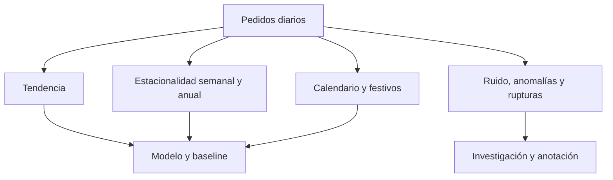

# Tendencia, estacionalidad, calendario y rupturas

## Objetivos y prerrequisitos

Separarás patrones sostenidos, repeticiones de calendario, ruido y cambios estructurales antes de atribuir una causa.

Una serie puede contener **tendencia** (movimiento de largo plazo), **estacionalidad** (patrón que se repite por día, semana o año), ciclos, ruido y rupturas. En Lumen los viernes pueden superar a los martes; noviembre puede contener un pico de campañas; y un cierre de zonas de reparto puede producir un cambio de nivel. Una caída de lunes a domingo puede ser normal; una caída frente al mismo lunes de semanas comparables merece investigación.

<!-- mobile-diagram: rendered fallback -->

Ver código Mermaid editable

Los componentes son ramas paralelas: no ocurren uno después de otro. Una descomposición puede ser **aditiva** si los efectos se suman aproximadamente (por ejemplo, +20 pedidos cada viernes) o **multiplicativa** si la amplitud crece con el nivel (por ejemplo, un 20 % más). Una transformación logarítmica puede ayudar en el segundo caso, pero no es una obligación ni admite ceros sin tratamiento explícito.

Descomponer no prueba causas. Un cambio de nivel puede coincidir con una campaña, una incidencia, un festivo, falta de stock o error de medición. Cruza eventos y segmentos antes de explicarlo; registra la ruptura para no entrenar un modelo que la interprete como estacionalidad permanente.

## Resumen

Compara contra referencias temporales adecuadas, no solo contra el periodo anterior. Sigue con [lags, autocorrelación y ventanas móviles](03-lags-y-previsiones-base.md).
