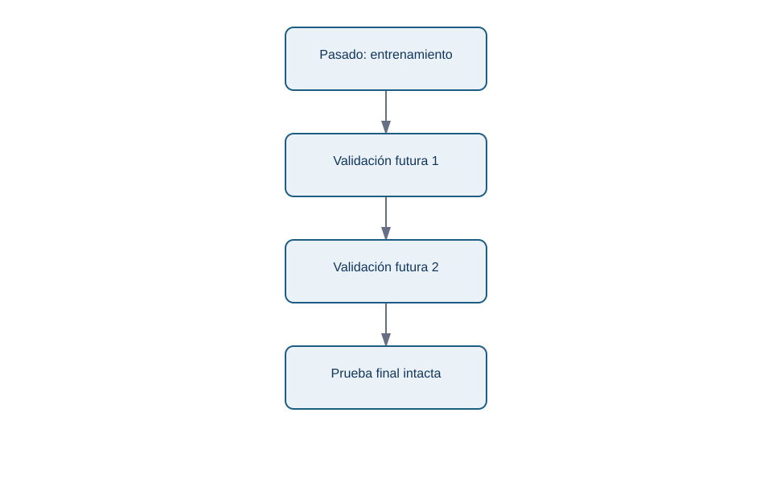
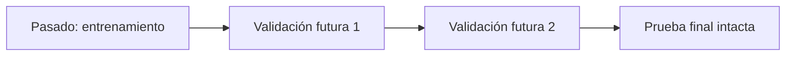

# Validación walk-forward y fuga de futuro

## Objetivos y prerrequisitos

Validarás una previsión como se usaría en producción: entrenar con pasado y comprobar contra futuro todavía desconocido.

Una partición temporal no se baraja. En Lumen puedes entrenar hasta septiembre, validar octubre-noviembre, ajustar una única vez y reservar diciembre como prueba final. Para conocer estabilidad, el enfoque **walk-forward** avanza sucesivos cortes: se predice la semana siguiente, se compara con lo observado y se avanza.

<!-- mobile-diagram: rendered fallback -->

Ver código Mermaid editable

Cada bloque está en orden temporal. La prueba final no decide parámetros ni umbrales; estima cómo habría rendido el proceso al desplegarlo.

Una **fuga de información** ocurre si una variable usa el futuro: una media móvil centrada, normalizar usando todos los meses o incluir un precio que se fijó después de la fecha de corte. Un resultado excepcionalmente bueno merece investigar fuga antes de celebrarlo.

## Resumen y práctica

La validación simula el momento de decisión. Sigue con [métricas de previsión](06-metricas-de-prevision.md).
