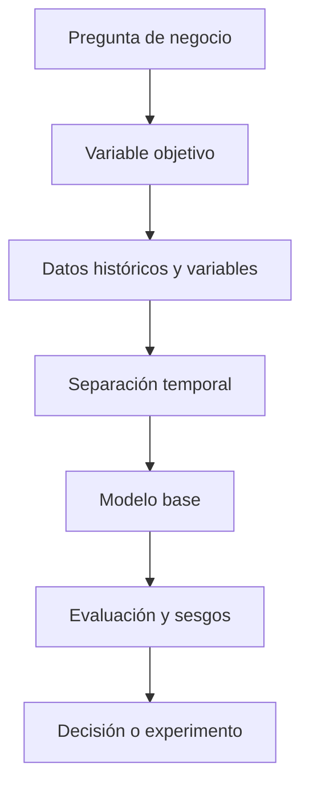

# Bloque 12 - Modelos predictivos para analistas

## Objetivo

Usar modelos predictivos de manera responsable para estimar resultados, priorizar casos y apoyar decisiones. El objetivo no es competir por la métrica más alta: es construir una predicción útil, válida y explicable.

## Predicción no es causalidad

Un modelo puede anticipar qué usuarios tienen riesgo de abandono sin demostrar por qué abandonarán ni qué intervención lo evitará. Usa predicción para priorizar y medir intervenciones aparte cuando la pregunta sea causal.

## Preparación y evaluación

Define el objetivo antes de tocar variables. Separa entrenamiento, validación y prueba sin filtrar información del futuro. Una fuga de información hace que un modelo parezca excelente en evaluación y fracase al usarse.

Para regresión usa errores como MAE o RMSE; para clasificación considera precisión, recall, F1, AUC y, sobre todo, el coste de cada error. Una métrica no reemplaza el contexto de negocio.

## Modelos que debe conocer un analista

Regresión lineal y logística son referencias interpretables. Árboles y ensembles capturan relaciones complejas, pero requieren más atención a validación e interpretación. Crea primero un baseline sencillo: superar una referencia honesta es más importante que usar el modelo más sofisticado.

## Interpretación y ética

Explica qué variables influyen, para qué población funciona y dónde puede fallar. Evita usar variables sensibles o proxies injustificados. Documenta el impacto de falsos positivos y falsos negativos antes de automatizar una acción.

## Práctica

Resuelve [el caso de churn](../../ejercicios/temario-12/aplicacion/priorizar-churn.md).
