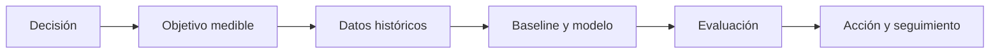

# Decidir si la predicción aporta valor

## Objetivos y prerrequisitos

Separarás una pregunta predictiva de una causal y definirás la decisión que una predicción puede mejorar.

Un modelo predictivo usa patrones históricos para estimar un resultado desconocido: probabilidad de abandono, demanda de mañana o importe esperado. Antes de modelar define quién recibirá la predicción, qué acción puede tomar y cuál es el coste de equivocarse.

Predecir riesgo de churn no demuestra por qué alguien abandonará ni qué oferta lo retendrá. Sirve para priorizar contacto; la eficacia de la intervención exige experimento o evidencia causal aparte.

## Resumen

Sin decisión y acción, una predicción puede ser interesante pero no valiosa. Sigue con [datos y fuga](02-preparacion-y-fuga.md).
