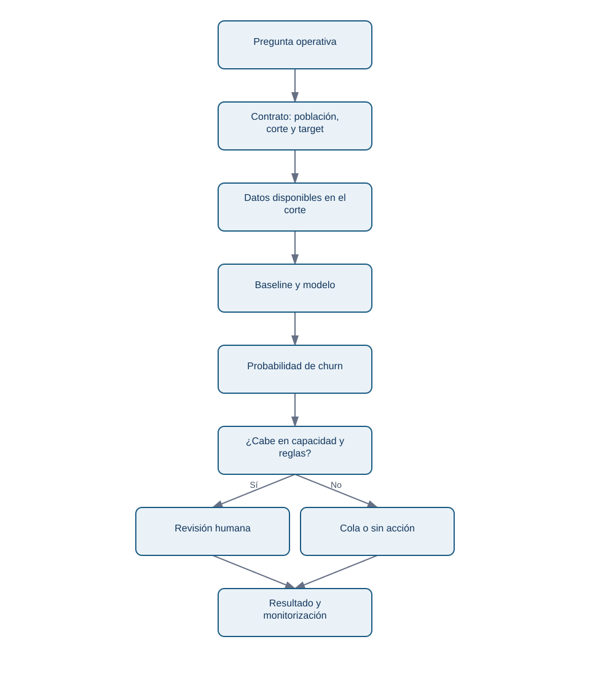
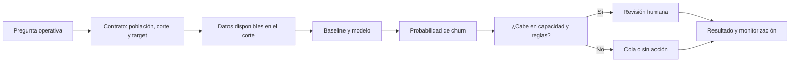

# 12.1 - Del problema de negocio al contrato predictivo

## Objetivos y prerrequisitos

Al terminar podrás decidir si una pregunta admite predicción y escribir un contrato que impida construir un modelo «correcto» para una decisión equivocada. Necesitas saber leer una tabla: una fila es una observación y una columna describe una propiedad.

## Antes de decir «modelo»

Lumen vende una suscripción mensual. Su equipo de éxito de cliente puede revisar **20 cuentas cada lunes**, pero no todas las cuentas pueden recibir atención intensiva. La pregunta no es «¿por qué abandonan las personas?»; es «¿qué 20 cuentas conviene revisar primero con la información disponible el lunes?». Un modelo puede ordenar riesgo; no prueba que una intervención vaya a evitar una baja.

En lenguaje cotidiano, una predicción es una estimación de algo aún desconocido a partir de casos anteriores parecidos. Su nombre técnico es **aprendizaje supervisado** cuando disponemos de ejemplos pasados con respuesta conocida. Aquí la respuesta, o **target**, será `churn_30d`: vale 1 si la cuenta canceló dentro de los 30 días posteriores al lunes de corte y 0 si no.

No confundas tres preguntas:

| Pregunta | Ejemplo en Lumen | Herramienta principal |
| --- | --- | --- |
| Descriptiva | ¿Cuántas cuentas cancelaron el mes pasado? | Métricas y análisis |
| Predictiva | ¿Qué cuentas cancelarán en 30 días? | Modelo de clasificación |
| Causal | ¿Una llamada de onboarding reduce cancelaciones? | Experimento o diseño causal |

Decir que las cuentas con pocos días activos tienen más churn no permite afirmar que «aumentar días activos» lo reduzca. Puede ser una señal del problema, no su causa.

## El contrato de predicción

Un contrato transforma una intuición en trabajo verificable. Para Lumen:

| Elemento | Decisión explícita |
| --- | --- |
| Unidad o grano | Una **cuenta** en cada lunes de corte, no un evento ni una persona individual. |
| Población | Cuentas de pago activas al comenzar el lunes. |
| Target | Cancelación durante los siguientes 30 días (`1`/`0`). |
| Fecha de corte | Cada lunes a las 09:00 Europe/Madrid. |
| Variables permitidas | Uso, facturación y soporte conocidos antes de esa hora. |
| Acción | Priorizar hasta 20 cuentas para revisión humana, no enviar una oferta automática. |
| Éxito operativo | Encontrar más cuentas que cancelarán sin saturar al equipo y sin perjuicio injustificado. |

La siguiente figura responde a «¿cómo una pregunta termina en una acción controlada?».

<!-- mobile-diagram: rendered fallback -->

Ver código Mermaid editable

La flecha hacia revisión humana es deliberada: una puntuación ordena casos, pero la política de atención decide qué se hace con ella.

## Ejemplo trabajado

El lunes 1 de junio, la cuenta Aster tiene 2 sesiones en los últimos 7 días, una factura impagada y 3 tickets. Todo eso ya era visible el lunes. Si Aster cancela el 20 de junio, su fila de corte del 1 de junio recibe `churn_30d=1`. Si registramos `fecha_cancelacion` como entrada, estaríamos entregando al modelo la respuesta disfrazada de columna.

El horizonte de 30 días no es arbitrario: permite que una persona contacte y haga seguimiento. Un horizonte de 24 horas daría poco margen; uno de 12 meses mezclaría decisiones y cambios de producto demasiado distintos.

## Error habitual y límite

Un objetivo mal definido crea métricas bonitas e inútiles. Por ejemplo, usar «canceló alguna vez» como target mezcla cuentas que cancelaron hace tres años con la decisión de este lunes. También es incorrecto llamar *churn* a una tarjeta caducada si el negocio considera que la cuenta vuelve a activar sin intervención: la definición debe estar acordada con producto y finanzas.

## Resumen y comprobación

- Un modelo predictivo estima un resultado futuro; no demuestra su causa.
- El contrato fija unidad, población, corte, horizonte, variables y acción.
- El umbral y la capacidad forman parte del sistema, no aparecen al final.

1. ¿Por qué «ofrecer un descuento» no es automáticamente la conclusión de un modelo de churn?
2. Para el corte del lunes, ¿una nota creada el martes es una variable permitida? ¿Por qué?

Continúa con [datos, partición temporal y fuga](02-preparacion-y-fuga.md).
