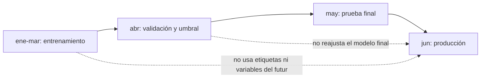

# 12.2 - Datos disponibles, partición temporal y fuga

## Objetivos y prerrequisitos

Al terminar sabrás convertir eventos en variables de una tabla de modelado, separar pasado y futuro y reconocer información filtrada. Partimos del contrato de Lumen de la lección anterior.

## De eventos a una fila que se puede decidir

Una aplicación guarda hechos sueltos: una sesión, un pago, un ticket. Para decidir el lunes, los resumimos en una fila por cuenta. Una **feature** o variable predictora es una columna que describe lo conocido antes del momento de predicción. Por ejemplo, `sesiones_7d=2` significa que Aster abrió la app dos veces en los siete días anteriores al corte.

| cuenta_id | corte | sesiones_7d | dias_desde_ultima_sesion | factura_impagada | tickets_30d | churn_30d |
| --- | --- | ---: | ---: | ---: | ---: | ---: |
| Aster | 2026-06-01 | 2 | 5 | 1 | 3 | 1 |
| Borea | 2026-06-01 | 18 | 0 | 0 | 0 | 0 |

La última columna se conoce solo después de esperar 30 días. Durante producción no existe todavía; solo se usa para aprender y evaluar ejemplos históricos.

## Partir por tiempo, no mezclar el futuro

En problemas donde el producto y los clientes cambian, imitar el futuro es más honesto que barajar filas. Entrena con cortes antiguos, ajusta decisiones con un periodo posterior y reserva un periodo final que nadie toca hasta el final.

La línea temporal permite responder a «¿habría funcionado con la información y el comportamiento de entonces?». Una división aleatoria puede poner en entrenamiento una observación posterior de la misma cuenta y hacer que la prueba parezca más fácil.

## Fuga de información: el excelente resultado sospechoso

Una **fuga** ocurre si una variable contiene, directa o indirectamente, información posterior al corte o información que no estará disponible al ejecutar la decisión. El modelo aprende la respuesta, no un patrón que pueda reutilizarse.

| Columna candidata | ¿Permitida el lunes? | Motivo |
| --- | --- | --- |
| Sesiones hasta el domingo | Sí | Ya ocurrieron antes del corte. |
| Factura vencida conocida | Sí | Puede consultarse antes de priorizar. |
| Motivo de cancelación | No | Solo aparece al cancelar. |
| Tickets cerrados en los próximos 30 días | No | Resume el futuro que se intenta predecir. |
| Media de churn calculada usando todo el año | No | Para enero incorpora resultados de meses futuros. |

Hay fugas menos obvias. Estandarizar una columna usando media y desviación de todo el conjunto deja que la prueba influya en el entrenamiento. Resolver valores ausentes, seleccionar variables o decidir hiperparámetros debe ajustarse con entrenamiento y aplicarse después, sin reaprender de validación ni prueba.

## Calidad y tratamiento mínimo

Antes de modelar, comprueba que cada cuenta aparece una vez por corte, que las unidades son coherentes y que un cero no significa «dato desconocido». `sesiones_7d=0` puede ser una observación válida; un valor vacío puede indicar que falló el seguimiento. Conserva una marca como `sesiones_disponibles` si la ausencia de registro tiene significado.

Una variable categórica, como plan `basic` o `pro`, necesita una codificación que el modelo pueda usar; no asignes arbitrariamente `basic=1` y `pro=2` si ese orden no existe. En cambio, una variable numérica como días desde la última sesión sí tiene orden y unidad.

## Ejemplo trabajado

Para el corte 1 de mayo, la variable `tickets_30d` cuenta tickets abiertos entre 1 y 30 de abril. Una consulta que usa hasta el 30 de mayo es fuga aunque se ejecute después para «preparar» datos. Escribe siempre el intervalo de cada feature: *inicio*, *fin* y *momento de disponibilidad*.

## Resumen y comprobación

- La tabla de modelado tiene una unidad definida y variables disponibles en el corte.
- Entrenamiento, validación y prueba respetan el orden temporal.
- Un rendimiento extraordinario obliga a buscar fuga antes de celebrarlo.

1. ¿Por qué una media calculada con todo el año puede ser fuga para una fila de enero?
2. ¿Qué diferencia hay entre un cero de sesiones y un valor ausente?

Sigue con [baselines y modelos sencillos](03-baselines-y-modelos.md).
