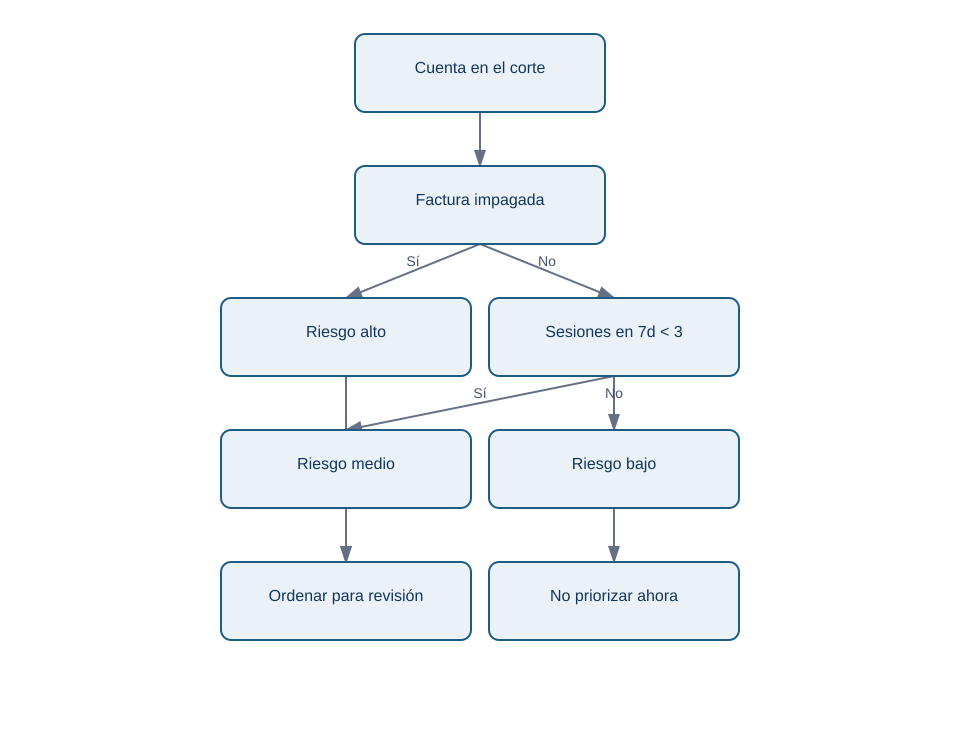
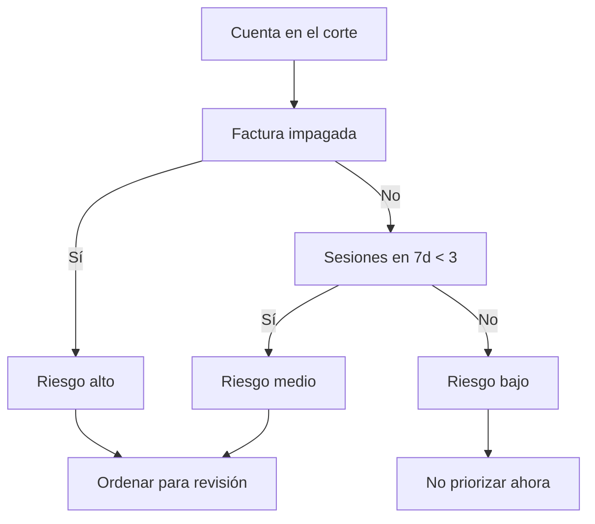

# 12.3 - Baselines, clasificación y modelos sencillos

## Objetivos y prerrequisitos

Compararás una regla de referencia con un modelo de clasificación y sabrás qué gana y qué pierde cada opción. Necesitas el concepto de feature, target y partición temporal.

## Qué intenta estimar una clasificación

En Lumen el resultado solo tiene dos clases: `1` significa churn y `0` significa continuidad. Una **clasificación binaria** estima la probabilidad de pertenecer a una clase, por ejemplo `P(churn_30d=1)=0,72`. No produce certeza: dos cuentas con 0,72 pueden tener destinos distintos.

El primer rival de cualquier modelo es un **baseline**, una referencia deliberadamente simple. Si el 12 % de las cuentas abandonan, un baseline de clase mayoritaria siempre predice «no churn». Acertará 88 % de veces, pero detectará cero abandonos: la exactitud (*accuracy*) por sí sola puede engañar.

## Tres niveles de complejidad

| Enfoque | Cómo funciona | Ventaja | Riesgo o límite |
| --- | --- | --- | --- |
| Mayoritaria | Predice siempre la clase más frecuente | Gratis y transparente | No prioriza riesgo. |
| Regla de negocio | «Riesgo alto si hay factura impagada y menos de 3 sesiones» | Revisable por operaciones | Puede ignorar combinaciones útiles. |
| Regresión logística | Combina variables y transforma un marcador en probabilidad | Interpretable y estable como base | Supone una forma de relación limitada. |
| Árbol pequeño | Hace preguntas sucesivas sobre variables | Capta umbrales e interacciones | Puede sobreajustarse si crece demasiado. |

Una regresión logística no es «lineal» en la probabilidad: combina las variables en un marcador y lo transforma para quedar entre 0 y 1. En un árbol, una regla puede ser «si sesiones_7d < 3, continuar; si además hay factura impagada, riesgo alto».

El siguiente diagrama responde a «¿cuándo una regla se convierte en predicción operativa?».

<!-- mobile-diagram: rendered fallback -->

Ver código Mermaid editable

Este árbol es didáctico, no una verdad causal. «Factura impagada» puede ser señal de un problema de cobro y requerir una ruta distinta a una llamada de éxito de cliente.

## Entrenar sin enamorarse del algoritmo

Entrenar significa ajustar parámetros o reglas usando ejemplos históricos. Validar significa comparar alternativas en periodos que el ajuste no vio. Empieza por la regla y la clase mayoritaria; después compara una regresión logística regularizada y un árbol limitado. Si el árbol añade una mejora minúscula pero duplica complejidad y empeora la explicación, quizá no compense.

Evita ajustar decenas de alternativas sobre la misma validación hasta encontrar una ganadora. Esa repetición convierte validación en entrenamiento encubierto. Registra qué versiones probaste y conserva la prueba final para una sola evaluación honesta.

## Ejemplo trabajado

En el laboratorio, el baseline mayoritario nunca marca churn. La regla de Lumen asigna una puntuación mayor si hay poco uso, factura pendiente o muchos tickets. No afirmamos que el score «entienda» a la persona; solo comprobamos si, en cortes posteriores, concentra más cancelaciones dentro de las 20 plazas disponibles.

## Resumen y comprobación

- Un baseline es obligatorio porque impide atribuir valor a complejidad vacía.
- Clasificar es estimar probabilidad o marcador de clase, no descubrir causas.
- Un modelo sencillo puede ser preferible si su rendimiento y uso son suficientes.

1. ¿Por qué 88 % de accuracy puede convivir con un modelo inútil para churn?
2. ¿Qué debe ocurrir antes de preferir un árbol más complejo a una regla?

Sigue con [métricas, umbrales y calibración](04-evaluacion-y-coste-de-error.md).
