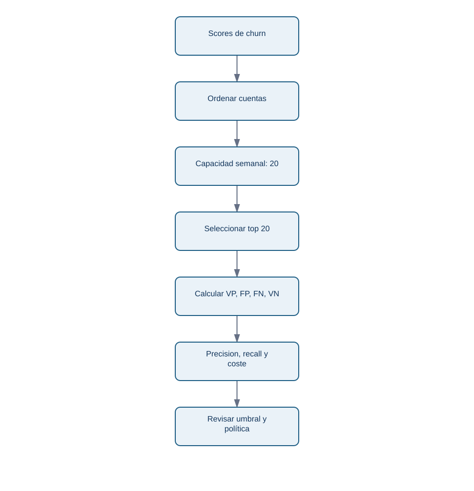

# 12.4 - Métricas, umbrales, capacidad y calibración

## Objetivos y prerrequisitos

Al terminar podrás interpretar una matriz de confusión, elegir un umbral coherente con la capacidad y distinguir capacidad de ordenación de probabilidades bien calibradas.

## De una probabilidad a cuatro resultados

El modelo entrega un score; un **umbral** lo convierte en aviso. Si Lumen marca churn a partir de `0,50`, cada cuenta queda en uno de cuatro grupos:

| Real / predicción | Priorizar churn | No priorizar |
| --- | ---: | ---: |
| Canceló | Verdadero positivo (VP) | Falso negativo (FN) |
| No canceló | Falso positivo (FP) | Verdadero negativo (VN) |

La matriz de confusión no decide por ti: muestra el tipo de equivocación. De ella salen:

- **Precision** = VP / (VP + FP): de las cuentas priorizadas, qué proporción canceló.
- **Recall** = VP / (VP + FN): de todas las que cancelaron, qué proporción detectamos.
- **F1**: media armónica de precision y recall; útil si ambas importan, pero no conoce el coste real.

Si hay solo 20 plazas, una precision alta en las primeras 20 puede importar más que recall global. Si la intervención es preventiva y barata, quizá prefieras detectar más casos aunque aumenten avisos incorrectos.

## Curvas: ordenar no es lo mismo que decidir

ROC-AUC resume cómo el score ordena, en promedio, positivos por encima de negativos para muchos umbrales. Puede parecer alta cuando churn es raro. PR-AUC resume el intercambio entre precision y recall y suele ser más informativa en clases desbalanceadas, como un 5 % de churn. Ninguna AUC responde cuántas cuentas debe atender el equipo: para eso inspecciona el umbral o el top-k real.

<!-- mobile-diagram: rendered fallback -->

Ver código Mermaid editable

El diagrama muestra que la capacidad viene antes de celebrar una métrica global: un modelo puede ordenar razonablemente y aun así no ser útil en las primeras 20 cuentas.

## Coste y umbral: ejemplo de Lumen

Supón que una revisión humana cuesta 15 EUR y que retener una cuenta evita una pérdida esperada de 120 EUR, pero una revisión solo consigue retener al 25 % de las cuentas que iban a cancelar. Un VP no vale automáticamente 120 EUR: su valor esperado sería `0,25 × 120 - 15 = 15 EUR`. Un FP cuesta 15 EUR. Este cálculo es un supuesto de negocio que debe revisarse con finanzas y con evidencia de la intervención.

El umbral 0,50 no es una ley. Si solo hay 20 plazas, se puede elegir el score de la vigésima cuenta como corte provisional y comprobar luego precision, beneficio esperado y daños por segmento. Si hay 200 plazas, el corte puede bajar. Cambiarlo altera operaciones, por lo que se registra como parte de la versión del sistema.

## Desbalanceo y calibración

Con 5 cancelaciones en 100 cuentas, un modelo que predice siempre continuidad tiene 95 % accuracy. Este **desbalanceo** obliga a mirar precision, recall, PR-AUC, top-k y costes, no solo accuracy. Reponderar clases o re-muestrear puede ayudar durante entrenamiento, pero la evaluación debe reflejar la prevalencia real de producción.

Una probabilidad está **calibrada** si, entre las cuentas con score cercano a 0,30, aproximadamente 30 % termina cancelando. Un modelo puede ordenar bien (AUC alta) pero sobreestimar sistemáticamente el riesgo. Agrupa scores en bandas, compara probabilidad media con proporción observada y recalibra solo usando datos de entrenamiento/validación, nunca la prueba final.

## Error habitual y límite

No optimices F1 por defecto: trata por igual un FP y un FN aunque la decisión no lo haga. Tampoco conviertas una probabilidad en promesa individual. Una banda de 0,70 describe frecuencia esperada en un grupo comparable, no destino garantizado para una persona.

## Resumen y comprobación

- Precision mide limpieza de la cola; recall mide cobertura de casos reales.
- ROC-AUC y PR-AUC evalúan ordenación, no sustituyen la política de capacidad.
- Calibrar hace interpretables las probabilidades; elegir umbral convierte el modelo en operación.

1. Si Lumen solo puede revisar 20 cuentas, ¿por qué puede ser mejor medir precision@20 que accuracy?
2. ¿Puede un modelo tener AUC alta y probabilidades mal calibradas? Explica cómo.

Sigue con [interpretación, sesgo y operación responsable](05-interpretacion-sesgo-y-uso-responsable.md).
