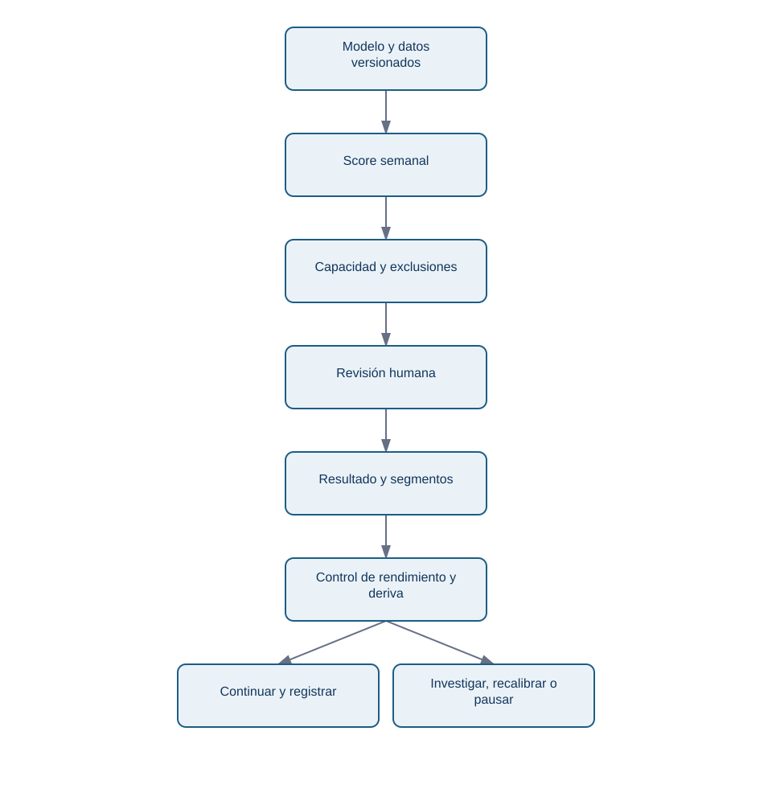
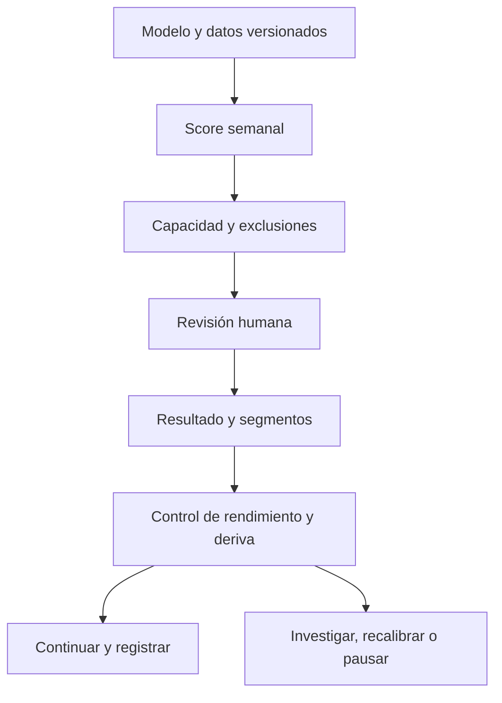

# 12.5 - Interpretación, sesgo, deriva y model card

## Objetivos y prerrequisitos

Al terminar podrás explicar una predicción sin convertir asociación en causalidad, comprobar riesgos por segmentos y documentar cómo se monitoriza un modelo en producción.

## Explicar una señal no es explicar una causa

Una regresión logística puede indicar que `dias_desde_ultima_sesion` empuja el score hacia arriba. Un árbol puede mostrar que una factura impagada aparece en una rama de riesgo alto. Eso es **interpretación predictiva**: describe cómo el modelo usa señales para ordenar casos. No demuestra que forzar una sesión o pagar una factura cause retención.

La distinción importa. Una cuenta puede dejar de usar la app porque su empresa redujo plantilla; el poco uso es una señal temprana, no necesariamente una palanca. Para estimar si una llamada, descuento o funcionalidad cambia churn se necesita experimento controlado u otro diseño causal del bloque avanzado.

## Sesgo, privacidad y revisión humana

Una variable aparentemente inocua puede ser un **proxy**: por ejemplo, horario de conexión puede correlacionarse con región, tipo de empleo o necesidades de accesibilidad. Antes de usarla, pregunta si es necesaria, si tiene calidad comparable y si puede producir un trato desigual. No recolectes atributos personales «por si acaso».

Evalúa al menos por segmentos operativos relevantes: plan, antigüedad, región si es legítima y tamaño de cuenta. Busca diferencias de cobertura (recall), avisos incorrectos (precision) y calidad de datos. Una diferencia no prueba discriminación por sí sola: puede deberse a tamaños pequeños o definición distinta, pero exige investigación y registro.

<!-- mobile-diagram: rendered fallback -->

Ver código Mermaid editable

El circuito se repite cada semana; se dibuja sin una flecha de vuelta para que el PDF no convierta el ciclo en una secuencia ilegible. Evita el error de «entrenar y olvidar»: las predicciones cambian la atención recibida, y esa atención también puede cambiar los datos con los que evaluamos.

## Deriva y monitorización

**Deriva de datos** significa que cambió la distribución de entradas: una nueva interfaz puede reducir sesiones registradas. **Deriva de concepto** significa que cambió la relación entre entradas y churn: un cambio de precio puede hacer que el mismo nivel de uso implique otro riesgo. Vigila semanalmente volumen, valores ausentes, distribución de scores, prevalencia observada cuando madure el horizonte, precision@20, recall por segmento y tasa de intervención.

No reentrenes automáticamente ante cualquier oscilación. Define umbrales de alerta, responsable y respuesta. Un salto de 40 % en valores ausentes puede requerir pausar el modelo porque falló el tracking; una caída persistente de precision puede requerir análisis del producto y revalidación temporal.

## Model card mínima de Lumen

Una **model card** es una ficha que permite a otra persona entender y auditar el sistema. Debe incluir:

| Campo | Ejemplo |
| --- | --- |
| Propósito | Priorizar revisión humana de churn a 30 días; no automatiza bajas ni precios. |
| Población y corte | Cuentas de pago activas, lunes 09:00 Europe/Madrid. |
| Datos y versión | Fuente, periodo, definición de cada variable y exclusiones. |
| Modelo y baseline | Regla versionada / regresión logística; baseline mayoritario. |
| Evaluación | Periodo de prueba, precision@20, recall, PR-AUC, calibración y segmentos. |
| Umbral/política | Top 20 por capacidad, reglas de exclusión y responsable. |
| Límites y riesgos | Fuga conocida, cambios de tracking, proxies, intervención no causal. |
| Monitorización | Métricas, frecuencia, dueño, umbrales y procedimiento de pausa. |

## Resumen y comprobación

- Importancia predictiva no equivale a causalidad ni a recomendación de intervención.
- Los modelos requieren controles de privacidad, segmentos y revisión humana proporcional al impacto.
- Una model card y monitorización convierten un experimento en un sistema responsable.

1. ¿Qué diferencia hay entre deriva de datos y deriva de concepto?
2. ¿Por qué una mejora de precision global podría ocultar un problema en un segmento?

Ahora ejecuta el [laboratorio de Lumen](../../../notebooks/practicas/12-priorizacion-churn.py) y resuelve el [ejercicio aplicado](../../../ejercicios/temario-12/aplicacion/priorizar-churn.md).
