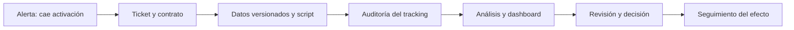

# Bloque 13 - Herramientas y reproducibilidad

## Propósito

Un análisis útil no termina cuando aparece una cifra: termina cuando otra persona puede entender qué se decidió, repetir el cálculo, revisar sus límites y usar el resultado sin romperlo. En este bloque Leo trabaja como analista de **Nébula**, una app B2B de gestión de reservas. Tras una versión nueva, la activación cae y Producto debe decidir si corregir, revertir o mantener el cambio.

La pregunta continua del bloque es: **¿ha reducido la versión 4.2 la activación de cuentas nuevas y qué evidencia reproducible justifica la siguiente acción?**. El caso conecta ticket, datos, código, instrumentación, dashboard, revisión y seguimiento.

## Resultados observables

Al terminar podrás convertir una petición vaga en un contrato de análisis, organizar un proyecto, usar Git sin confundir historia con copia de seguridad, auditar un tracking plan, entregar un dashboard gobernado y documentar una decisión trazable.

**Prerrequisitos:** Bloques 00-10. No se presupone experiencia con Jira, Git, Amplitude ni una herramienta de BI: se presentan como respuestas a problemas de colaboración concretos.

## Mapa del caso

La cadena no afirma que una herramienta garantice calidad. Cada flecha es una evidencia que permite comprobar la siguiente: un panel no puede arreglar una definición ambigua, ni un commit puede justificar una recomendación sin datos válidos.

## Lecciones

1. [De petición a ticket analítico](lecciones/01-ticket-analitico.md)
2. [Proyecto reproducible y Git](lecciones/02-proyecto-reproducible-y-git.md)
3. [Notebooks, scripts y revisión de pares](lecciones/03-notebooks-scripts-y-revision.md)
4. [Instrumentación, tracking plan y Amplitude](lecciones/04-instrumentacion-y-amplitude.md)
5. [BI, dashboards y contrato de métrica](lecciones/05-bi-y-dashboards.md)
6. [Entrega, seguimiento y comunicación](lecciones/06-entrega-y-seguimiento.md)

## Práctica y laboratorio

Resuelve la [investigación reproducible de activación](../../ejercicios/temario-13/aplicacion/investigacion-activacion.md) antes de consultar la [solución razonada](../../soluciones/temario-13/investigacion-activacion.md). Ejecuta el [laboratorio](../../notebooks/practicas/13-activacion-reproducible.py) desde el móvil con un intérprete Python online o en tu ordenador; no requiere paquetes externos ni datos personales.

## Criterio de dominio

No basta con saber nombrar Jira, Amplitude, Git o Power BI. Debes poder explicar qué evidencia deja cada uno, qué no demuestra, cómo detectar una definición rota y cómo otra persona reproduce tu conclusión.
